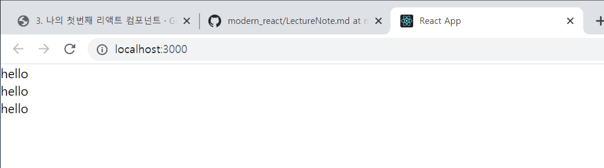

## 1장. 리액트 입문

### 1-1. 리액트는 어쩌다 만들어 졌을까?
DOM을 직접 건드리면서 이벤트 핸들러, 상태값을 직접 작업하는 것은 규모가 커지면서 난잡해진다.


그래서, AngularJS와 같은 다양한 프레임워크들이 나왔다. 이런 프레임워크들은 JS의 특정 값이 바뀌면 DOM속성이 업데이트 되도록 해서 작업을 간소화 시켜주는 방식이다.

리액트는 어떠한 상태가 바뀌었을때, 그 상태에 따라 DOM을 어떻게 업데이트 할 지 규칙을 정하는 것이 아니라, 처음부터 모든걸 새로 만들어서 보여주면 어떻까? 라는 아이디어에서 개발이 시작되었다.


모든걸 새로 만들게 된다면, 랜더링 속도가 굉장히 느려질 것이다. 리액트는 Virtual DOM을 사용하여 이를 가능하게 했다.
virtual DOM은 브라우저에서 보여지는 DOM이 아니라 메모리에서 가상으로 존재하는 DOM으로 JS객체이기 때문에 속도가 매우 빠르다.
리액트 개발팀에서 만든 효율적인 비교 알고리즘을 통해 REAL DOM과 비교하여 차이가 있는 곳을 감지하여 REAL DOM에 패치 시켜 준다.


### 1-2. 작업환경 준비
- Node.js
- Yarn : npm의 개선된 버전
- VSCode
- Git 

### 1-3. 첫번째 리액트 컴포넌트
Hello.js 컴포넌트 만들기

```js
import React from 'react'

function Hello() {
    return <div>hello</div>
}

export default Hello;
```

 


### 1-4. JSX의 기본 규칙 알아보기
리엑트 컴포넌트에서 XML형태로 코드를 작성하면 babel이 JSX를 JS로 변환해준다.

Babel은 JS 문법을 확장해주는 도구로, 구형 브라우저 환경에서도 최신 JS문법을 제대로 실행할 수 있도록 해준다.

JSX의 몇가지 규칙이 있다.
- 꼭 감싸져야하는 태그
두가지 이상의 태그는 무조건 하나의 태그로 감싸져있어야 한다.
```js
// 잘못된 예
function App() {
  return (
    <Hello />
    <div>안녕히계세요.</div>
  );
}
```

```js
// 정상, <> Fragment 사용
function App() {
  return (
    <> 
      <Hello />
      <div>안녕히계세요</div>
    </>
  );
}
```

- JSX안에 JS사용하기
JSX 내부에 JS 변수를 사용할 때는 {}로 감싸준다.
```js
function App(){
    const name='react';
    return (
        <>
            <Hello />
            <div> {name} </div>
        </>
    )
}
```

- style과 className

style과 ClassName을 설정하는법이 HTML과 다르다.
먼저, inline 형태로 작성해야하며, background-color와 같이 - 로 구분된 이름은 backgroundColor 처럼 camelCase 형태로 네이밍 해야한다.

css class를 설정 할 경우 class= 가 아닌 className= 으로 해주어한다.

```js
import './App.css'

function App(){
    const style = {
        backgroundColor: 'black',
        fontSize: 24
    }

    return {
        <>
            <div className="gray-box" style={style} /> 
        </>
    }
}
```

- 주석
```js
{/* */}
```

### 1-5. props를 통해 컴포넌트에게 값 전달

```js
function Hello(props){
  return <div> hi, {props.name} </div>
}
```

- 여러개의 props 비구조화 할당

```js
// App.js
...
function App(){
  <Hello name="kim" color="blue" />
}
...
```

```js
// Hello.js

function Hello({name, color}) {
  return <div style={{color: color}}> {name} </div>
}
...
```

- defaultProps 설정
```js
// Hello.js
...
Hello.defaultProps = {
  name: "이름없음"
}
...
```

- props.children
: 컴포넌트 태그안에 넣은 값을 조회하고 싶을 때, props.children으로 조회한다.(?)


### 1-6. 조건부 렌더링
- JSX에서는 null, false, undefined를 렌더링하면 아무것도 나타내지 않는다.

```js
// 3항 연산자 이용
{ isSpecial ? <b>*</b> : null }

// && 연산자 이용
{ isSpecial && <b>*</b> }

```

- props에 값을 생략하면 ={true}와 동일하다.


### 1-7. useState를 통해 컴포넌트에서 바뀌는 값 관리하기

: 지금까지는 컴포넌트에 동적인 로직이 하나도 없었다. 이번에는 컴포넌트가 사용자 액션에 따라 동적으로 바뀌어야할때 어떻게 구현하는지 알아본다.

리액트 16.8부터 도입된 Hooks를 이용하여 상태관리를 해본다.

- /src/Counter.js 생성
- 동적인 상태 관리 : useState()
- 함수형 업데이트 : 컴포넌트를 최적할 때 사용한다.
```js
// Counter.js
...
const [number, setnumber] = useState(0)
const onIncrement = () => {
  setnumber(prev => prev + 1)
}
```


### 1-8. input 상태관리하기
: 직접 구현

### 1-9. 여러개의 input상태 관리하기
: 여러개의 input 상태를 관리할때, useState를 여러번 사용하여 구현할 수도 있지만, 이는 좋은 방법이 아니다.
: input에 name 속성을 설정하고 이벤트가 발생했을 때, name 속성을 참조하는 방법이 좋다. useState에서는 문자열이 아니라 input의 상태들을 객체 형태로 관리한다.

- 리액트의 state를 수정할때는 불변성을 유지 해야한다. [immutable]
```js
...
const [inputs, setInputs] = useState({})
...
setInputs({
  ...inputs, //spread문법
  [name]: value
})
...
```

### 1-10. useRef로 특정 DOM 선택하기
: JS에서 특정 DOM을 선택할 때 getElementById()를 사용한다.
: 리액트에서 특정 DOM을 선택할 때 ref를 사용한다.
: 함수형 컴포넌트에서는 ref를 사용할 때는 useRef() Hook 함수를 사용한다.
: useRef()로 ref객체를 만든뒤, 원하는 DOM에 ref속성에 매핑해줘야 한다.


### 1-11. 배열 렌더링하기
: JS의 map() 함수를 사용.
```js
users.map( user => <User user={user} />)
```
: 리액트에서 배열을 랜더링 할 때에는 'key'라는 props를 설정해야한다.

- key를 미설정한 경우: 
- key를 설정한 경우 : 


### 1-12. useRef로 컴포넌트 안의 변수 만들기
: useRef()는 특정 DOM element를 선택하는 용도 외에도, 컴포넌트 안에서 조회 및 수정 할 수 있는 변수를 관리할 수 있다.

- setTimeout, setInterval을 통해서 만들어진 id
- 외부 라이브러리를 사용하여 생성된 인스턴스
- scroll 위치


### 1-13. 배열에 항목 추가하기
: 실습

### 1-14. 배열에 항목 제거하기
: User 컴포넌트에 삭제button을 생성하고 삭제 기능 구현
: setusers()에서 불변성을 유지하며 users list를 수정하기위해 JS의 filter 함수를 사용했다.
```js
users.filter( user => user.id != id )
```


### 1-15. 배열에 항목 수정하기


### 1-16. useEffect를 사용하여 mount/unmount/update 시 할 작업 설정하기

