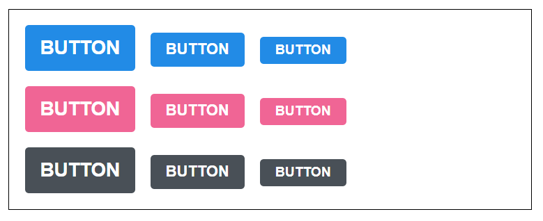
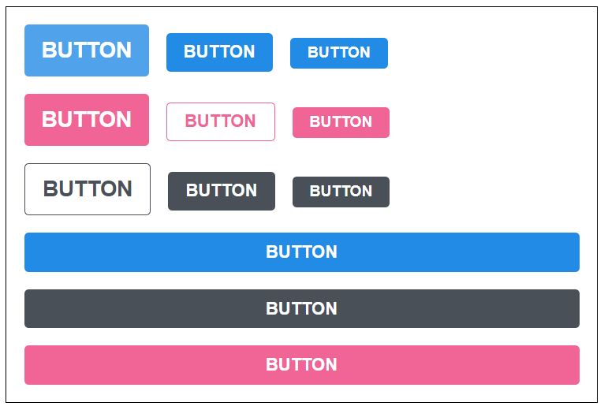

## 2장. 리액트 컴포넌트 스타일링하기

이 튜토리얼에서는 리액트 프로젝트에서 컴포넌트를 스타일링 할 때 자주 사용되는 다음 기술들에 대하여 다뤄보게 됩니다.

1. Sass
2. CSS Module
3. styled-components

재사용성이 높은 버튼을 만드는 방법, 커스텀 체크 박스를 만드는 방법, 그리고 모달을 만드는 방법을 알아보겠습니다.

## 2-1. Sass (Syntactically Awesome Style Sheets.) - 문법적으로 짱 멋찐 스타일시트
Sass는 CSS pre-processor로서, 복잡한 작업을 쉽게 할 수 있게 해주고, 코드의 재활용성을 높여줄 뿐만아리가, 코드의 가독성을 높여주어 유지보수를 쉽게 해준다.

Sass에 대해서 제대로 알아보고 싶다면 아래 링크를 참조한다.
- [밸로퍼트 포스트](https://velopert.com/1712)
- [Sass 공식 가이드](https://sass-guidelin.es/ko/)

Sass에서는 두가지 확장자 (.scss/.sass)를 지원한다.
Sass가 처음 나왔을 땐 sass만 지원되었으며 sass는 문법이 아주 다르다.
```css
// sass
$font-stack:    Helvetica, sans-serif
$primary-color: #333

body
  font: 100% $font-stack
  color: $primary-color
```

```scss
//scss
$font-stack:    Helvetica, sans-serif;
$primary-color: #333;

body {
  font: 100% $font-stack;
  color: $primary-color;
}
```
더 많은 차이점은 [여기](https://sass-lang.com/guide)서 비교해볼 수 있다. 보통 scss문법이 더 많이 사용되므로, .scss 확장자 스타일로 작성해보자.

#### 시작하기
먼저 새로운 리액트 프로젝트를 만들고 해당 프로젝트에 node-sass라는 라이브러리를 설치한다.
```bash
$ npx create-react-app styling-with-sass
$ cd styling-with-sass
$ npm install node-sass //Sass를 CSS로 변환해주는 모듈
```

#### Button 컴포넌트 만들기
src디렉터리에 components 디렉터리를 생성하고 그 안에 Button.js 컴포넌트를 만든다.
```js
// src/component/Button.js
import React from 'react';
import './Button.scss'

function Button({children}){
    return (
        <button className="Button">{children}</button>
    )
}

export default Button;
```
같은 위치에 Button.scss 파일도 만든다.
```scss
$blue: #228be6; //주석 선언

.Button {
    display: inline-flex;
    color: white;
    font-weight: bold;
    outline: none;
    border-radius: 4px;
    border: none;
    cursor: pointer;

    height: 2.25rem;
    padding-left: 1rem;
    padding-right: 1rem;
    font-size: 1rem;

    background: $blue; // 주석 사용
    &:hover {
        background: lighten($blue, 10%); // 색상 10% 밝게
    }

    &:active {
        background: darken($blue, 10%); // 색상 10% 어둡게
    }
}
```
css와 차이점으로 $blue: #aaa; 이런 식으로 변수를 선언할 수 있고, lighten(), darken()과 같은 함수를 사용할 수도 있다.

이제 Button컴포넌트를 App컴포넌트에서 사용해보자.

```js
import React from 'react';
import Button from './components/Button'

function AppSass(){
    return (
        <>
            <Button />
        </>
    )
}

export default AppSass;
```


#### 버튼 사이즈 조정하기
버튼 크기를 large, medium, samll로 설정할 수 있도록 구현해보자.
Button.js에서 다음과 같이 defaultProps를 사용해 size의 기본 값을 medium으로 설정하고, 이 값을 button의 className에 넣는다.

```js
function Button({children, size}){
    return (
        <button className={["Button", size].join(' ')}>
            {children}
        </button>
    )
}

Button.defaultProps = {
    size: 'medium'
}
```
className에 CSS클래스를 동적으로 넣어주려면 
- className={['class1', size].join(' ')}
- className={`class1 ${size}`}
위 두가지 방식으로 할 수 있다.

하지만 동적으로 CSS className을 넣어주고 싶다면 직접 문자열을 조합하는 것 보다. 'classnames'라는 라이브러리를 이용하는 것이 편하다.

```js
npm install classnames
=============================
classNames('foo', { bar: true, duck: false }, 'baz', { quux: true }); // => 'foo bar baz quux'

// false, null, 0, undefined 는 무시됩니다.
classNames(null, false, 'bar', undefined, 0, 1, { baz: null }, ''); // => 'bar 1'
```

Button.js에 classnames lib를 사용하여 className을 동적으로 지정해주고, AppSass.js에 large, medium, small Button을 추가해준다.
```scss
// 사이즈 관리
    &.large {
        height: 3rem;
        padding-left: 1rem;
        padding-right: 1rem;
        font-size: 1.25rem;
    }
    &.medium {
        height: 2.25rem;
        padding-left: 1rem;
        padding-right: 1rem;
        font-size: 1rem;
    }
    &.small {
        height: 1.75rem;
        font-size: 0.875rem;
        padding-left: 1rem;
        padding-right: 1rem;
    }
```


Button 컴포넌트들이 함께 있을 때 여백을 추가해주자.
```scss
 // 함께 있을 때 여백추가
    & + & {
        margin-left: 1rem;
    }
```
& + & 가 의미 하는 것은 .Button + .Button 입니다. 만약 함께 있다면 우측에 있는 버튼에 여백을 준다.


#### 버튼 색상 설정하기
Button 에서 color 라는 props 를 받아올 수 있도록 해주고, 기본 값을 blue 로 설정해주세요. 그리고, size 와 마찬가지로 color 값을 className 에 포함한다.

- Button.js에 color props 추가
- button.scss에 &.blue, &.gary, &.pink 추가, 이때 Sass 의 @mixin 기능을 사용하여 반복되는 코드 줄이기
- AppSass.js에 pink, gary Button 그룹 생성
- App.scss에서 .buttons 간 상단 여백 추가




#### outline 옵션 만들기
outline 이라는 옵션을 주면 버튼에서 테두리만 보여지도록 설정해보자.

- Button.js에 outline props추가
- Button.scss의 button-color @mixin에 &.outline 코드를 추가
- AppSass.js에 outline 옵션 사용


#### 전체 너비를 차지하는 옵션
fullWidth 라는 옵션이 있으면 버튼이 전체 너비를 차지하도록 구현을 해본다.
- Button.js에 fullWidth 옵션 추가
- Button.scss에 &.fullwidth 코드 추가
- AppSass.js에 fullWidth 옵션 사용




#### ...rest props 전달하기
이벤트가 필요할 때마다 onEvent()를 매번 넣어주는건 귀찮다. 이런 귀차니즘을 해결해줄 수 있는 문법이 바로 [spread와 rest](https://learnjs.vlpt.us/useful/07-spread-and-rest.html)이다.

```js
function Button({children, size, color, outline, fullWidth, ...rest}){
    return (
        <button 
            className={classNames('Button', size, color, {outline}, {fullWidth})}
            {...rest}
        >
```

주로 state객체를 다룰 때 사용했던 spread문법을 컴포넌트에서 props 설정할 때 사용할 수 도 있다.


## 2-2. CSS Module
리액트 프로젝트에서 컴포넌트를 스타일링 할 때 CSS Module이라는 기술을 사용하면, CSS 클래스가 중첩되는 것을 방지할 수 있다.

CRA로 만든 프로젝트에서 CSS Module을 사용 할 때, CSS 파일의 확장자를 .moudule.css로 하면된다. ex) Box.module.css
```css
.Box {
    background: black;
    color: white;
    padding: 2rem;
}
```
리액트 컴포넌트에서 .modules.css를 불러올 때 .modules.css에 선언한 클래스 이름들이 모두 고유해집니다. 고유 CSS 클래스 이름이 만들어지는 과정에서는 파일 경로, 이름, 클래스 이름, 해쉬값 등이 사용될 수 있다.
```js
import React from 'ract'
import styles from './Box.module.css'

function Box(){
    return (
        <div className={styles.Box}>{styles.Box}</div>
    )
}
export default Box;
```
className이 고유하게 만들어지기 때문에, 실수로 CSS의 클래스 이름이 다른 CSS클래스 이름과 중복이될 일이 없다.

이 기술은 다음과 같은 상황에서 유용하다.
- 레거시 프로젝트에 리액트를 도입할때, 기존 CSS의 클래스 이름과 리액트에서 도입한 CSS 클래스 이름이 중복되지 않는다.
- CSS 네이밍 규칙을 만들기 귀찮을 때

CSS Module은 CRA로 만들 프로젝트에서는 별도로 설치할 라이브러리가 없다. CSS Module은 Webpack 에서 사용하는 [css-loader](https://github.com/webpack-contrib/css-loader)에서 지원한다.

### 기타 내용
CSS Module은 Sass에서도 사용할 수 있다. 확장자를 .module.sass로 바꿔주면 된다.

CSS Module을 사용하고 있는 파일에서 특정 클래스 이름을 고유화 하지 않고 전역적인 클래스 이름으로 사용하고 싶다면 다음과 같이 작성하면 된다.
```css
// CSS
:global .my-global-name {}

// Sass
:global {
    .my-global-name {}
}
```