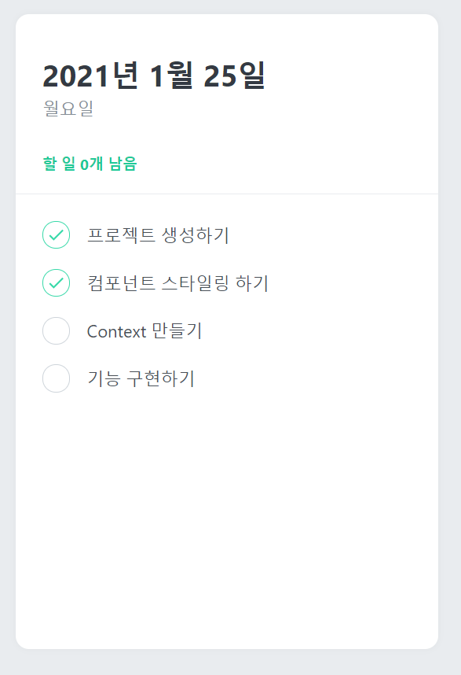
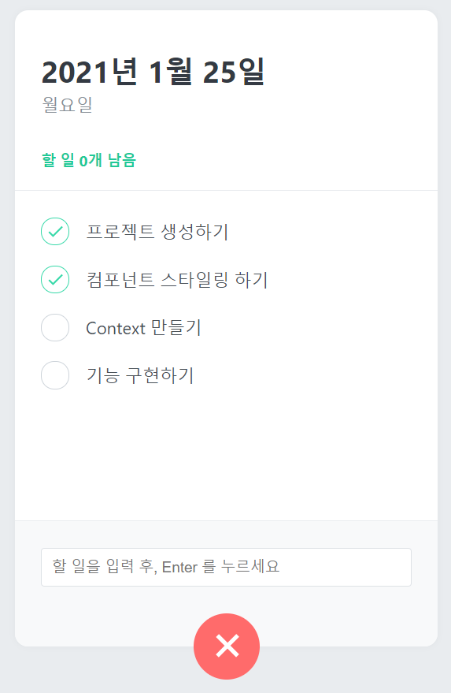

## 3장. 멋진 TodoList 만들기
TodoList App을 만드는 과정에서 지금까지 배운 다양한 개념들을 활용한다.
1. styled-components를 활용한 컴포넌트 스타일링
2. Context API를 사용한 전역 상태관리
3. 배열 상태 다루기


## 3-1. 컴포넌트 만들기

### 만들어야 할 컴포넌트 확인하기
만들어야할 컴포넌트는 총 5개 이다.
1. TodoTemplate : TodoList의 레이아웃, 페이지 중앙에 그림자가 적용된 흰색박스
2. TodoHead : 오늘 날짜, 요일을 보여주고 할 일이 몇개 남았는지 보여준다.
3. TodoList : 할 일에 대한 정보가 들어있는 todos 배열을 map을 사용해 랜더링 해준다.
4. TodoItem : 각 할 일에 대한 정보를 랜더링 해준다. 좌측의 원을 누르면 Toggle 할 수 있다. 마우스를 올리면 휴지통 아이콘이 나타나고 누르면 삭제된다.
5. TodoCreate : 새로운 할 일을 등록할 수 있는 컴포넌트이다. TodoTemplate 하단에 할 일을 입력할 수 있는 폼이 나타난다.


### 페이지에 회색 배경색상 적용
styled-components를 사용하여 페이지에 회색(#e9ecef) 배경색상을 적용한다. styled-components에서 전역 스타일을 추가하고 싶을 땐, [createGlobalStyle](https://www.styled-components.com/docs/api#createglobalstyle)을 사용한다.


### TodoTemplate 만들기
- 흰색 박스 모양의 TodoTemplate 컴포넌트 생성

### TodoHead 만들기
- 오늘 날짜, 요일, 남을 todo 개수를 보여준다.
- TodoTemplate의 children으로 랜더링 해준다.

### TodoList 만들기
- background를 gary로 설정해서 TodoList 영역이 잘 설정되었는지 확인

### TodoItem 만들기
- [react-icons](https://react-icons.netlify.com/#/icons/md)에서 MdDone과 MdDelete 아이콘을 사용한다. (설치 필요)
- styled-components의 [Component Selector](https://www.styled-components.com/docs/advanced#referring-to-other-components)로 Remove 버튼 처리



### TodoCreate 만들기
- react-icons의 MdAdd 아이콘 사용
- useState를 사용하여 open state를 관리한다.
- open 상태가 true일 때 아이콘을 45도 돌려 X자로 보여지게 한다.
- todo를 입력할 수 있는 form을 보여준다.


## 3-2. Context API를 활용한 상태관리
TodoList App에서 기본적인 상태 관리는 다음과 같은 구조로 구현된다.

App 컴포넌트에서 todos, onRemove, onToggle ... 상태과 함수들을 가지고 있고, 해당 값을 props를 통해 자식 컴포넌트들에게 전달해주는 방식으로 구현한 예시이다.

하지만 프로젝트가 커지면 위와 같은 상태관리는 
- App 컴포넌트 코드가 복잡짐
- 자식 컴포넌트의 props로 값이나 함수를 전달하기 어려워짐
과 같은 문제가 발생한다.

따라서, Context API를 활용하여 상태 또는 함수 관리를 깔끔하게 할 수 있다.


### 리듀서 만들기
state 관리를 위해 /src/TodoContext.js 파일을 생성하고 TodoProvider 라는 컴포넌트를 만든다.
- useReducer()로 상태를 관리한다.
- initialState를 정의한다.
- reducer() 함수를 작성한다. (CREATE, TOGGLE, REMOVE)
- TodoProvider 컴포넌트는 UI가 없다.


### Context 만들기
- createContext()로 전역에서 관리한 state 또는 함수를 설정한다.
- 하나의 context에 state와 dispatch를 함께 넣어주는 대신 각각의 context에 state와 dispatch를 따로 설정한다. 이렇게하면 dispatch만 필요한 컴포넌트에서 불필요한 랜더링을 방지할 수 있다.
```js
...
const TodoStateContext = createContext();
const TodoDispatchContext = createContext();
...
return (
    <TodoStateContext.Provider value={state}>
      <TodoDispatchContext.Provider value={dispatch}>
        {children}
      </TodoDispatchContext.Provider>
    </TodoStateContext.Provider>
  );
```


### 커스텀 Hook 만들기
컴포넌트에서 useContext로 context값에 접근하는 방식 대신, useContext를 사용하는 커스텀 Hook를 만들어 context값에 접근하도록 만들어보자.
```js
...
export function useTodoState() {
  return useContext(TodoStateContext);
}

export function useTodoDispatch() {
  return useContext(TodoDispatchContext);
}
```
기능적으로 차이는 없고, 단순히 사용성 편의를 위한 작업이다.


### nextId 값 관리하기
useRef()를 사용하여 todo의 고유 ID를 관리한다.


### 커스텀 Hook에서 에러 처리
필수 사항은 아니지만, context에 접근할 수 없는 곳에서 context를 호출 했을 경우 실수를 빠르게 확인할 수 있다.
```js
export function useTodoState() {
  const context = useContext(TodoStateContext);
  if (!context) {
    throw new Error('Cannot find TodoProvider');
  }
  return context;
}
```


### 컴포넌트 TodoProvider로 감싸기
AppTodo.js 에서 컴포넌트 최상단에 모든 하위 컴포넌트를 감싸도록 TodoProvider를 위치 시킨다.
```js
function App() {
  return (
    <TodoProvider>
      <GlobalStyle />
      <TodoTemplate>
        <TodoHead />
        <TodoList />
        <TodoCreate />
      </TodoTemplate>
    </TodoProvider>
  );
}
```


### 각 컴포넌트에서 사용하기
TodoHead 컴포넌트에서 todos state가 필요한 경우 다음과 같이 useTodoState 커스텀 Hook를 통해 전역 state 값을 불러올 수 있다.
```js
...
import { useTodoState } from '../TodoContext'
...
const todos = useTodoState();
...
```


## 3-3. 기능 구현하기
이전 강의에서 구현한 Todo Components들과 Context API 값들을 이용하여 TodoList App을 완성해보자.

### TodoHead 완성하기
- todos state배열에서 todo.done 값이 false인 요소의 갯수 보여주기
```js
const count = todos.filter( todo => !todo.done ).length
```
- 날짜 보여주기
  - Date클래스의 toLocaleString() 함수 사용
  ```js
  const today = new Date();
    const date = today.toLocaleDateString('ko-KR', {
        year: 'numeric',
        month: 'long',
        day:'numeric'
    })
    const dayName = today.toLocaleDateString('ko-KR', {weekday: 'long'})
  ```
### TodoList 완성하기
- todos state를 Context API로부터 조회
- 조회한 todos 배열을 TodoItem 컴포넌트로 map()
```js
function TodoList() {
  const todos = useTodoState();
  
  return <TodoListBlock>
    {todos && todos.map( todo => <TodoItem key={todo.id} todo={todo}/>)}
  </TodoListBlock>;
}
```

### TodoItem 완성하기
- dispatch를 사용하여 Toggle과 Remove기능 구현
- TodoItem export 코드에 React.memo()를 사용
  - React.memo를 사용하면 다른 항목이 업데이트 될 때 불필요한 리랜더링을 방지 할 수 있다.


### TodoCreate 완성하기
- 컴포넌트 자체적으로 input 상태관리가 필요하다. (useState)
- dispatch와 nextId값을 context로부터 가져온다.
- React.memo로 컴포넌트를 감싸준다.
  - state가 바뀔 때 TodoCreate 컴포넌트의 불필요한 리랜더링을 방지
