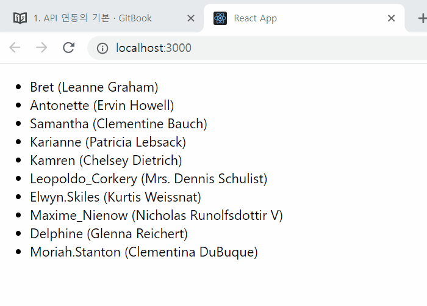
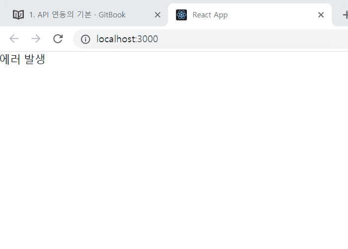
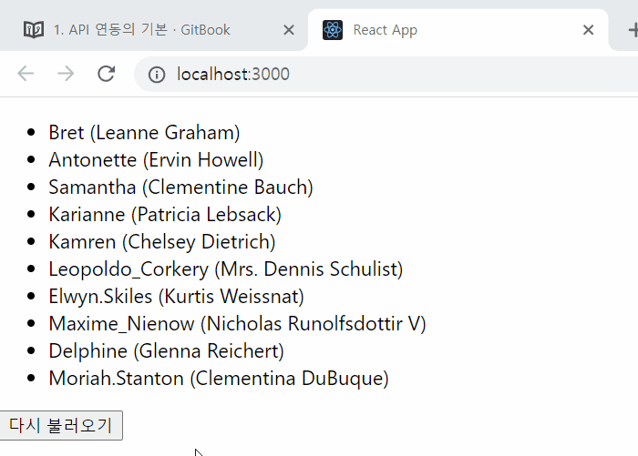
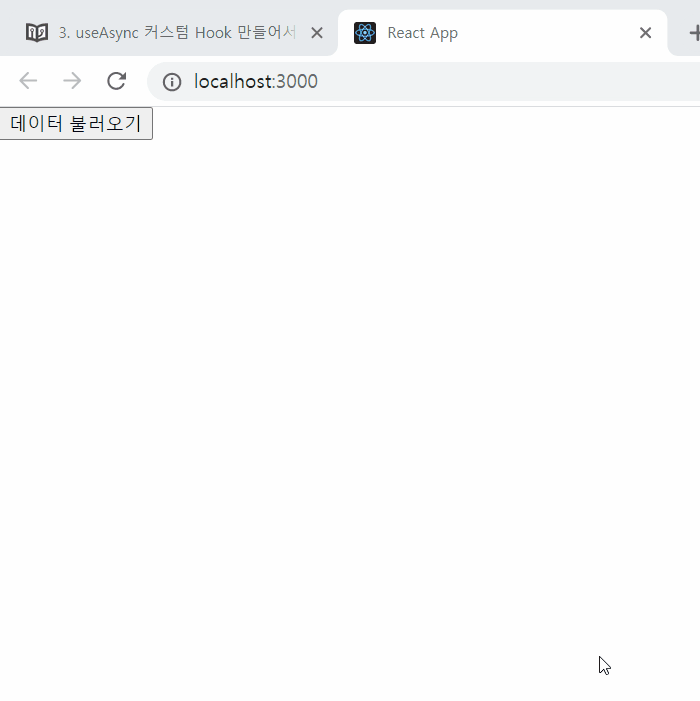

## 4장. API연동하기
실제 웹 어플리케이션에서는 서버와 API통신을 통해 데이터를 주고 받게된다. 주로 [Redux](https://redux.js.org/)라는 라이브러리와 Redux Middleware를 함께 사용하여 구현하는 경우가 많다. 

API를 연동함에 있어서 Redux가 필수적인 요소는 아니다. 이번 장에서는 Redux없이 API연동을 하는 방법을 알아보고, 깔끔한 코드로 구현하는 방법에 대해 배워본다.

이번 장을 진행하기 위해 JavaScript의 비동기 처리에 대한 기본적인 개념을 숙지하고 있어야한다. Promise와 anyce/await에 대해 잘 모른다면, [밸로퍼트 모던 JS](https://learnjs.vlpt.us/async/)를 통해 개념을 공부한 뒤 진행한다.

## 4-1. API 연동의 기본
API를 호출하기 위해서 [axios](https://github.com/axios/axios)라는 라이브러리를 설치한다.

axios를 사용해서 HTTP 메서드로 API요청을 할 수 있다.
- GET : 데이터 조회
- POST : 데이터 등록
- PUT : 데이터 수정
- DELETE : 데이터 삭제
기타 PATCH, HEAD 등등의 HTTP 메서드들이 있다.

axios의 사용법은 다음과 같다.
```js
import axios from 'axios'

axios.get('/user/1');  
axios.post('/users', {
    username: 'name1',
    age: 20
})
```

API 연동 실습에는 [JSONPlaceholder](https://jsonplaceholder.typicode.com/)에 있는 연습용 API를 사용할 것이다.

- url : https://jsonplaceholder.typicode.com/users
```json
[
  {
    "id": 1,
    "name": "Leanne Graham",
    "username": "Bret",
    "email": "Sincere@april.biz",
    "address": {
      "street": "Kulas Light",
      "suite": "Apt. 556",
      "city": "Gwenborough",
      "zipcode": "92998-3874",
      "geo": {
        "lat": "-37.3159",
        "lng": "81.1496"
      }
    },
    ...
  }
```

### useState와 useEffect로 데이터 로딩하기
useState로 요청상태를 관리하고, useEffect로 컴포넌트 랜더링 시점에 요청을 보내는 작업을 해본다.

requset state를 관리할 때는 다음 3가지 state를 관리해야한다.
1. reqeust 결과
2. 로딩 상태
3. 에러

src 디렉토리에 Users.js를 생성하고 다음 코드를 작성한다.

```js
import React, { useEffect, useState } from 'react'
import axios from 'axios'

function Users(){
    const [users, setUsers] = useState(null);
    const [loading, setLoading] = useState(false);
    const [error, setError] = useState(null)

    useEffect(()=>{
        const fetchUsers = async () => {
            try{
                setUsers(null);
                setError(null);
                setLoading(true);

                const res = await axios.get('https://jsonplaceholder.typicode.com/users');

                setUsers(res.data)
            } catch (e) {
                setError(e)
            }
            setLoading(false);
        };
        fetchUsers();
    }, []);

    if(loading) return <div>로딩중...</div>;
    if(error) return <div>에러 발생</div>;
    if(!users) return null;
    return (
        <ul>
            {users.map( user => (
                <li key={user.id}>
                    {user.username} ({user.name})
                </li>
            ))}
        </ul>
    )
}

export default Users
```



### 에러발생 확인하기
요청 URL을 이상하게 바꾸어 에러를 발생시켜보자.




### 버튼을 눌러 API 재요청하기
fetchUser 함수를 useEffect Hook 밖으로 꺼내주고, 버튼에 연결해준다.



## 4-2. useReducer로 요청 상태 관리하기
useState대신 useReducer로 API 상태관리를 구현해본다.
'LOADING', 'SUCCESS', 'ERROR'

```js
import React, { useEffect, useReducer } from 'react'
import axios from 'axios'

const initialState = {
    loading: false,
    error: null,
    users: null
}

function reducer(state, action) {
    switch(action.type){
        case 'LOADING':
            return {
                users: null,
                loading: true,
                error: null
            }
        case 'SUCCESS':
            return {
                users: action.users,
                loading: false,
                error: null
            }
        case 'ERROR':
            return {
                users: null,
                loading: false,
                error: action.error
            }
        default:
            throw new Error(`Unhandled action type: ${action.type}`);
    }
}

function Users(){
    const [state, dispatch] = useReducer(reducer, initialState);
    
    const fetchUsers = async () => {
        try{
            dispatch({type:'LOADING'})
            const res = await axios.get(
                'https://jsonplaceholder.typicode.com/users'
                );
            dispatch({type:'SUCCESS', users: res.data})
            
        } catch (e) {
            dispatch({type:'ERROR', error:e})
        }
    };

    useEffect(()=>{
        fetchUsers();
    }, []);

    const {loading, error, users} = state;

    if(loading) return <div>로딩중...</div>;
    if(error) return <div>에러 발생</div>;
    if(!users) return <div>user없음</div>;

    return (
        <>
            <ul>
                {users.map( user => (
                    <li key={user.id}>
                        {user.username} ({user.name})
                    </li>
                ))}
            </ul>
            <button onClick={fetchUsers}>다시 불러오기</button>
        </>
    )
}

export default Users
```

## 4-3. useAsync 커스텀 Hook 만들어 사용하기
API 통신을 할 때 마다 리듀서를 작성하는 것은 번거롭다. 매번 반복되는 'LOADING', 'SUCCESS', 'ERROR' 코드를 커스텀 Hook로 만들어서 요청 상태 관리 로직을 쉽게 재사용가능하도록 구현한다.

 ```js
 import { useReducer, useEffect } from 'react';

function reducer(state, action) {
    switch (action.type) {
      case 'LOADING':
        return {
          loading: true,
          data: null,
          error: null
        };
      case 'SUCCESS':
        return {
          loading: false,
          data: action.data,
          error: null
        };
      case 'ERROR':
        return {
          loading: false,
          data: null,
          error: action.error
        };
      default:
        throw new Error(`Unhandled action type: ${action.type}`);
    }
  }

  function useAsync(callback, deps = []) {
    const [state, dispatch] = useReducer(reducer, {
        loading: false,
        data: null,
        error: false
      });

      const fetchData = async () => {
        dispatch({ type: 'LOADING' });
        try {
          const data = await callback();
          dispatch({ type: 'SUCCESS', data });
        } catch (e) {
          dispatch({ type: 'ERROR', error: e });
        }
      };

      useEffect(() => {
        fetchData();
        // eslint 설정을 다음 줄에서만 비활성화
        // eslint-disable-next-line
      }, deps);

      return [state, fetchData];
  }

  export default useAsync;
 ```

 useAsync 함수는 두가지 파라미터를 받는다. 
 1. API요청을 시작하는 콜백 함수
 2. useEffect의 deps

deps 값은 나중에 사용할 비동기 함수에서 파라미터가 필요하고, 그 파라미터가 바뀔 때 새로운 데이터를 불러오고 싶은 경우에 활용한다. default 값은 []이다, 즉 컴포넌트가 처음 랜더링 할 때만 API를 호출하고 싶다는 의미이다.

useAsync Hook 함수의 리턴값은 [state, fetchData]이다. fetchData함수를 사용하여 API 요청을 쉽게 처리할 수 있다.


### 데이터 나중에 불러오기
User 컴포넌트는 처음 랜더링 되는 시점부터 API를 요청하고 있다. 특정 버튼을 눌렀을 때만 API요청을 하도록 구현해보자.

useAsync 세번째 파라미터로 skip을 추가한다.
```js
 function useAsync(callback, deps = [], skip=false) {
     ...
     useEffect(() => {
          if (skip) return;
          fetchData();    
    }
    ...
 }
```


### API 호출 시 파라미터가 필요한 경우
User 한명의 상세정보를 보여주는 User 컴포넌트를 만들고, prop로 id를 넘겨 https://jsonplaceholder.typicode.com/users/1 와 같이 파라미터를 추가하여 API요청을 보낸다.

```js
import React from 'react';
import axios from 'axios';
import useAsync from './useAsync';

async function getUser(id) {
  const response = await axios.get(
    `https://jsonplaceholder.typicode.com/users/${id}`
  );
  return response.data;
}

function User({ id }) {
  const [state] = useAsync(() => getUser(id), [id]);
  const { loading, data: user, error } = state;

  if (loading) return <div>로딩중..</div>;
  if (error) return <div>에러가 발생했습니다</div>;
  if (!user) return null;

  return (
    <div>
      <h2>{user.username}</h2>
      <p>
        <b>Email:</b> {user.email}
      </p>
    </div>
  );
}

export default User;
```

id 가 바뀔 때 마다 재호출 되도록 deps 에 id 를 넣어준다.

