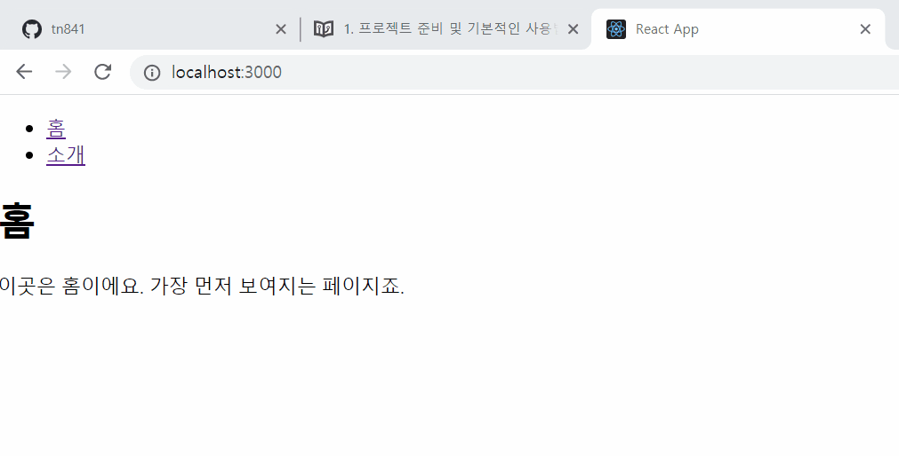
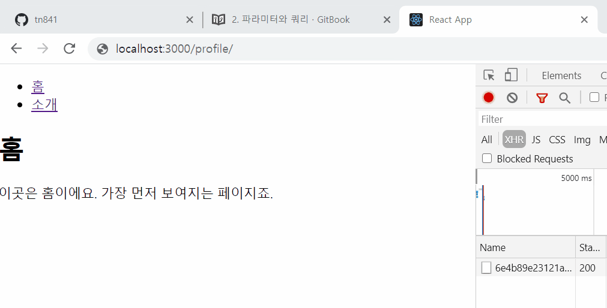
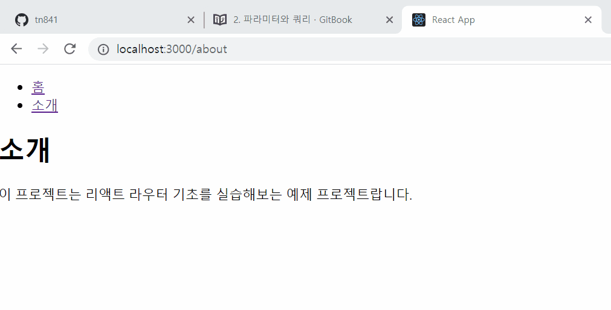
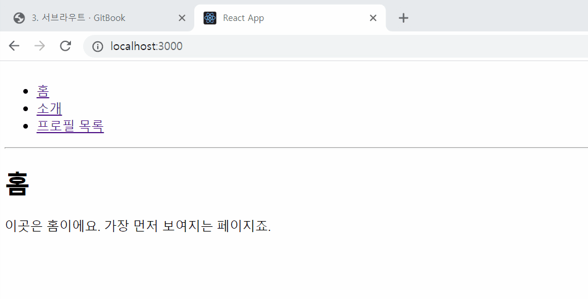

## 5장. 리액트 라우터
react-router를 사용하여 리액트 싱글 페이지 App 만들기

## SPA란?
Single Page Application의 약자로, 페이지가 1개인 어플리케이션을 말한다. 전통적인 웹어플리케이션은 여러 페이지로 구성되어있다. 유저가 요청을 보낼 때 마다 페이지가 새로고침되며, 페이지를 로딩할 때 마다 서버로부터 데이터를 전달받아 랜더링 한다. HTML파일, 템플릿 엔진등을 사용해 어플리케이션의 뷰가 어떻게 보여질지도 서버에서 담당했다.

요즘은 웹에서 제공되는 정보가 정말 많기 때문에 속도적인 측면에서 전통적인 방식은 문제가 있었고, 이를 해소하기 위해 캐싱과 압축을 하여 서비스가 제공된다. 이런 방식도 사용자와 인터랙션이 많은 모던 웹 어플리케이션에서는 충분하지 않을 수 있다. 랜더링을 서버에서 담당한다는 것은 그만큼 서버의 자원이 사용되는 것이고, 불필요한 트래픽도 낭비되는 것이다.

그래서 우리는 리액트 같은 라이브러리를 사용해서 뷰 랜더링을 유저의 브라우저가 담당하도록 하고 정말 필요한 데이터만 전달해서 보여주는 방식을 사용한다.

싱글페이지라고 해서 정말 한 화면만 있는건 아니다. 예를 들어 블로그를 만든다면 홈, 포스트 목록, 글쓰기 등등의 화면이 있고 각 화면에 따라 주소도 만들어 주어야 한다. 페이지 주소가 있어야 유저들이 즐겨찾기를 할 수도 있고 검색엔진을 통해 유입될 수 있기 때문이다. URL 주소에 따라 다른 뷰를 보여주는 것을 라우팅 이라고 한다. 리액트 자체에는 이 라우팅 기능이 내장되어 있지 않다.  따라서 우리가 직접 브라우저의 API를 사용하고 상태를 설정해서 주소에 따른 뷰를 보여주어야 한다.

이번 장에서 배우게 될 react-router는 써드파티 라이브러리로서, 리액트 공식 라이브러리는 아니지만 리액트 라우팅 라이브러리로 가장많이 사용되고 있다. react-router는 클라이언트 사이드에서 이루어지는 라우팅을 간단하게 구현해준다. 게다가 서버 사이드 랜더링도 도와주는 도구들이 함께 제공된다.

여러 화면으로 구성된 리액트 웹 어플리케이션을 만든다면 react-router는 필수이다.

### SPA의 단점
앱의 규모가 커지면 자바스크립트 파일 사이즈가 너무 커진다는 단점이 있다. 실제로 유저가 방문하지 않을 수 있는 페이지에 대한 스크립트도 한번에 불러오기 때문이다. 하지만 [Code Splitting](https://velog.io/@velopert/react-code-splitting)을 사용하여 라우트 별로 파일들을 나누어 트래픽과 로딩속도를 개선할 수 있다.

리액트 라우터같이 브라우저측에서 자바스크립트를 사용하여 라우트를 관리하는것의 잠재적인 단점은, 자바스크립트를 실행하지 않는 일반 크롤러에선 페이지의 정보를 제대로 받아가지 못한다는 점 입니다. 때문에, 구글, 네이버, 다음 등 검색엔진에서 페이지가 검색결과에서 잘 안타날수도 있습니다. 추가적으로, 자바스크립트가 실행될때까지 페이지가 비어있기 때문에, 자바스크립트 파일이 아직 캐싱되지 않은 사용자는 아주 짧은 시간동안 흰 페이지가 나타날 수도 있다는 단점도 있습니다. 이는, 서버사이드 렌더링을 통하여 해결 할 수 있습니다.

코드스플리팅과 서버사이드 렌더링은 지금 다루기엔 복잡한 개념들이므로, 나중에 다루도록 하겠습니다.

## 5-1. 프로젝트 준비 및 react-router 기본 사용법
먼저 react-router를 설치한다.
```bash
npm install react-router
```

### 프로젝트에 라우터 적용
라우터 적용은 index.js에서 BrowserRouter라는 컴포넌트를 사용하여 구현한다.

```js
// /src/index.js
import { BrowserRouter } from 'react-router-dom'; // * BrowserRouter 불러오기
ReactDOM.render(
  <BrowserRouter>
    <App />
  </BrowserRouter>,
  document.getElementById('root')
);
```

### 페이지 만들기
라우트로 사용할 페이지 컴포넌트를 만들 차례이다. 웹사이트에 가장 처음 들어왔을 때 보여줄 Home 컴포넌트와, 웹사이트 소개를 보여주는 About페이지를 만들어보자.

```js
// /src/Home.js
import React from 'react';

const Home = () => {
  return (
    <div>
      <h1>홈</h1>
      <p>이곳은 홈이에요. 가장 먼저 보여지는 페이지죠.</p>
    </div>
  );
};

export default Home;
```

```js
// /src/About.js
import React from 'react';

const About = () => {
  return (
    <div>
      <h1>소개</h1>
      <p>이 프로젝트는 리액트 라우터 기초를 실습해보는 예제 프로젝트랍니다.</p>
    </div>
  );
};

export default About;
```


### Route: 특정 주소에 컴포넌트 연결하기
사용자가 요청하는 주소에 따라 다른 컴포넌트를 보여줄 수 있다. 이 작업을 할 때는 Route라는 컴포넌트를 사용한다.

```js
<Route path="주소 규칙" component={보여줄 컴포넌트}>
```

AppRouter.js에 Route 컴포넌트를 추가해보자.

```js
// /src/AppRouter.js

import React from 'react'
import { Route } from 'react-router-dom'
import Home from './Home'
import About from './About'

function AppRouter(){
    return (
        <>
            <Route path="/" exact={true} component={Home} />
            <Route path="/about" component={About} />
        </>
    )
}

export default AppRouter
```

path="/"가 정상적으로 동작하게 하려면 exact prop를 ture러 설정 해야한다. 안그러면 /about일 때, Home과 About 컴포넌트가 함께 보이게 된다.


### Link: 누르면 다른 주소로 이동하기
react-router-dom을 사용할 땐 일반 <a>태그를 사용하면 안된다. 대신 Link 컴포넌트를 사용해야한다. 왜나하면 <a>태그는 기본적으로 페이지를 이동시킬때 페이지를 아예 새로 불러오게 된다. 그렇게 되면 리액트 앱이 가지고 있는 데이터들이 모두 초기화 되기 때문에 <a>태그 대신 Link 컴포넌트를 사용해야한다. Link 컴포넌트는 [HTML5 History API](https://developer.mozilla.org/ko/docs/Web/API/History)를 사용하여 브라우저의 주소만 바꿀뿐 페이지를 새로 불러오지 않는다.

```js
// /src/AppRouter.js

function AppRouter(){
    return (
        <>
        <ul>
            <li>
                <Link to="/">홈</Link>
            </li>
            <li>
                <Link to="/about">소개</Link>
            </li>
        </ul>
            <Route path="/" exact={true} component={Home} />
            <Route path="/about" component={About} />
        </>
    )
}
```




## 5-2. 파라미터와 쿼리
페이지 주소를 정의 할 때, 값을 전달하는 경우 파라미터와 쿼리 형태로 나타낼 수 있다.
- 파라미터 : /profiles/tn841
- 쿼리 : /about?detail=true

정해진 규칙은 없으나, 일반적으로 파라미터는 특정 ID나 이름을 가지고 조회할 때 사용하고, 쿼리는 키워드를 검색하거나 옵션을 지정할 때 사용한다.

### URL Params
Profile 페이지에서 파라미터를 사용해보자.
```js
// /src/Profile.js
import React from 'react';

// 프로필에서 사용 할 데이터
const profileData = {
  sumin: {
    name: '김수민',
    description: 'react를 공부하는 개발자'
  },
  gildong: {
    name: '홍길동',
    description: '전래동화의 주인공'
  }
};

const Profile = ({ match }) => {
  // 파라미터를 받아올 땐 match 안에 들어있는 params 값을 참조합니다.
  const { username } = match.params;
  const profile = profileData[username];
  if (!profile) {
    return <div>존재하지 않는 유저입니다.</div>;
  }
  return (
    <div>
      <h3>
        {username}({profile.name})
      </h3>
      <p>{profile.description}</p>
    </div>
  );
};

export default Profile;
```
파라미터를 받아올 땐 props.match.params 값을 참조한다. match객체 안에는 현재의 주소가 Route컴포넌트에서 정한 규칙과 어떻게 일치하는지에 대한 정보가 들어 있다.

Profile 컴포넌트를 AppRouter에 적용해본다. path='/profile/:username' 이렇게 적용하면 username에 해당하는 값을 파라미터로 넣어주어 Profile 컴포넌트에서 props.match.params로 전달 받을 수 있다.




### Query
About페이지에서 쿼리를 받아와보자. 쿼리는 Route컴포넌트에게 props로 전달되는 location객체에 있는 search값에서 읽어올 수 있다. location객체는 현재 앱이 갖고 있는 주소에 대한 정보를 가지고 있다.

```js
{
  key: 'ac3df4', // not with HashHistory!
  pathname: '/somewhere'
  search: '?some=search-string',
  hash: '#howdy',
  state: {
    [userDefined]: true
  }
}
```
location 객체에서 search 값을 확인해야한다. serach값은 문자열로 되어 있는데, 문자열을 쿼리스트링으로 바꾸어주는 [qs](https://www.npmjs.com/package/qs)라이브러리를 이용하여 쉽게 사용가능하다.

About 컴포넌트에서 location.serach에 있는 데이터를 받아와서 ture일 때 추가 정보를 보여주도록 구현 해보자.

```js
import React from 'react';
import qs from 'qs'

const About = ({location}) => {
    console.log(location)
  const query = qs.parse(location.search, {
    ignoreQueryPrefix: true
  })


  const detail = query.detail === 'true' // 파싱결과는 문자열이다.

  return (
    <div>
      <h1>소개</h1>
      <p>이 프로젝트는 리액트 라우터 기초를 실습해보는 예제 프로젝트랍니다.</p>
      {detail && <p>추가정보를 표시합니다.</p>}
    </div>
  );
};

export default About;
```



## 5-3. 서브라우트
서브라우트란 라우트 내부에 라우트를 만드는 것을 말한다. Route 컴포넌트 안에 Route컴포넌트를 랜더링하면된다.

### 서브라우트 만들어보기
Profiles라는 컴포넌트를 만들어서, 그 안에 각 유저들의 프로필 링크들과 프로필 라우트를 함께 랜더링 해보자.

```js
// /src/Profiles.js

import React from 'react'
import {Link, Route} from 'react-router-dom'

function Profiles(){
    return (
        <div>
            <h3>유저 목록:</h3>
            <ul>
                <li>
                <Link to="/profiles/sumin">sumin</Link>
                </li>
                <li>
                <Link to="/profiles/gildong">gildong</Link>
                </li>
            </ul>

            <Route
                path="/profiles"
                exact
                render={() => <div>유저를 선택해주세요.</div>}
            />
            <Route path="/profiles/:username" component={Profile} />
        </div>
    )
}

export default Profiles;
```

Route컴포넌트에서 component 속성 대신 render 속성을 사용하여 JSX를 바로 랜더링 할 수 있다.



특정 라우트 내에 탭 같은것을 만들게될 경우, state로 관리하는 것 보다 서브라우로 관리하는 것을 권장한다. setState로 상태관리를 할 필요가 없고, 링크를 통해 다른 컴포넌트로 쉽게 진입할 수 있으며, 검색엔진 크롤링도 가능하기 때문이다.