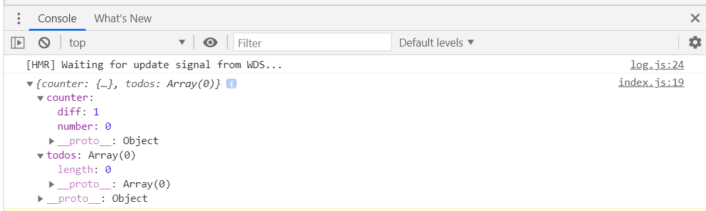
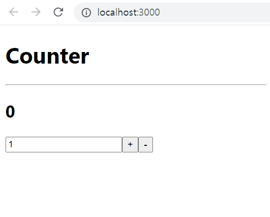
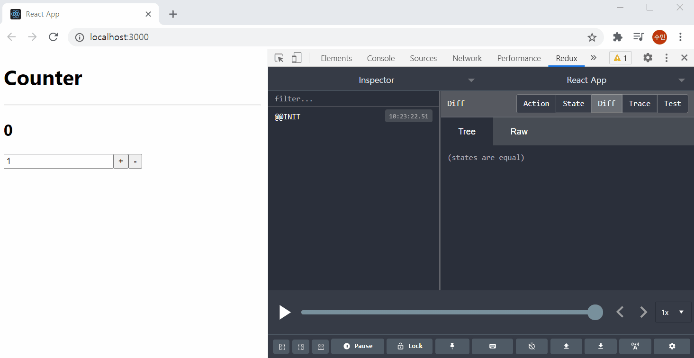

# 리덕스

이번 챕터에서 알아볼 주제는 리덕스(Redux) 입니다. 리덕스는 리액트 생태계에서 가장 사용률이 높은 상태관리 라이브러리입니다. 리덕스를 사용하면 여러분이 만들게 될 컴포넌트들의 상태 관련 로직들을 다른 파일들로 분리시켜서 더욱 효율적으로 관리 할 수 있으며 글로벌 상태 관리도 손쉽게 할 수 있습니다. 우리가 이전에 배운 Context API 를 사용해도 글로벌 상태 관리를 할 수 있고 상태 관리 로직을 분리 할 수 있습니다. 특히, Context API 와 useReducer Hook 을 사용해서 개발하는 흐름은 리덕스를 사용하는 것과 매우 개발 방식이 유사합니다. 리덕스에서도 리듀서와 액션이라는 개념을 사용하거든요.

Redux는 Context API 가 지금의 형태로 사용방식이 개선되기도 전에, 그리고 useReducer 라는 Hook 이 존재하기도 전 부터 만들어진 라이브러리입니다. 사실 Context API 가 개선되기 전에는 프로젝트에서 글로벌 상태관리를 하는게 굉장히 까다로웠어요. 그래서 리덕스가 글로벌 상태 관리 용도로 많이 사용되어 왔었습니다.


npmtrends 를 통해 알 수 있는 사실은, 리액트를 사용하는 프로젝트 중 45%가 리덕스를 사용하고 있다는 것 입니다.

> 참고로 redux 는 리액트에서 사용하기 위해 만들어진 라이브러리이긴 하지만 무조건 리액트와 함께 사용 할 필요는 없습니다. 일반 JavaScript 환경에서 사용 할 수도 있고 Angular 와 같은 다른 프레임워크에서도 사용되기도 합니다. 이러한 이유 때문에 위 이미지를 보면 react-redux 보다 redux 의 다운로드 수치가 훨씬 높은 것 입니다.

그런데 리덕스에 대해서 배워보기 전에 한가지를 확실히 해 둘 것이 있습니다. 저렇게 많이 사용된다고 해서 여러분의 프로젝트에 리덕스가 무조건 필요하지는 않습니다. 물론, 잘 활용하면 상황에 따라 그리고 여러분의 취향에 따라 프로젝트 개발 생산성에 아주 큰 도움을 줄 수도 있습니다. 하지만 단순히 글로벌 상태 관리를 위한 것이라면 Context API를 활용하는 것 만으로 충분 할 수 있습니다.

### 리덕스를 사용하는 것과 Context API를 사용하는 것의 차이
#### 1. 미들웨어 지원
: 리덕스에는 미들웨어(Middleware)라는 개념이 존재한다. 리덕스로 상태 관리를 할 때는 useRuducer에서 사용하는 reducer함수를 사용한다. 리덕스 미들웨어를 사용하면 action객체가 reducer함수에서 처리되기 전에 원하는 작업을 수행할 수 있다. 예를들어,

- 특정 조건에 따라 action이 무시되게 만듦
- action을 콘솔에 로깅하거나 서버에 로깅할 수 있음
- action이 dispatch됐을 때, 이를 수정해서 reducer 함수에 전달할 수 있음
- 특정 action이 발생했을 때, 이에 기반하여 다른 action이 발생되도록 할 수 있음
- 특정 action이 발생했을 때, JS함수를 실행할 수 있음

미들웨어는 주로 비동기 작업을 처리 할 때 많이 사용됩니다.


#### 2. 유용한 함수와 Hooks
: Context API를 사용할 때는 아래와 같은 작업들이 필요하다.
- useRudcer로 state와 dispatch를 만듦
- Context 컴포넌트를 만듦
- Context.Provider 설정
- useContext를 편리하게 하기 위해 커스텀 Hook 생성

리덕스에는 이러한 작업들을 편리하게 해주는 여러 기능들이 존재한다.

connect 함수를 사용하면 리덕스의 상태 또는 액션 생성 함수를 컴포넌트의 props로 받아올 수 있으며, useSelector, useDispatch, useStore와 같은 Hook를 사용하면 손쉽게 상태조회, 액션 dispatch가 가능하다.

connect 함수와 useSelector 함수 내부에는 최적화가 잘 되어 있어, 실제 상태가 바뀔때만 컴포넌트가 리랜더링된다. 반면 Context API는 최적화가 자동으로 이루어지지 않기 때문에 Context.Provdier 내부의 컴포넌트 들이 모두 리랜더링 된다.


#### 3. 하나의 커다란 State
: Context API 를 사용해서 글로벌 상태를 관리 할 때에는 일반적으로 기능별로 Context를 만들어서 사용하는 것이 일반적입니다 (물론 꼭 그렇게 할 필요는 없습니다). 반면 리덕스에서는 모든 글로벌 상태를 하나의 커다란 상태 객체에 넣어서 사용하는 것이 필수입니다. 때문에 매번 Context를 새로 만드는 수고로움을 덜 수 있습니다.

### 리덕스는 언제 써야 할까?
1. 프로젝트의 규모가 큰가?
    - 크면 Redux, 작으면 Context API
2. 비동기 작업을 자주 하는가?
    - 자주하면 Redux
3. 리덕스가 편리한가?
    - 그렇다면 Redux


## 6-1. 리덕스에서 사용되는 키워드 숙지
useRudcer를 사용할 때 접한 개념과 비슷하다.

- [Action](#Action)
- [ActionCreator](#ActionCreator)
- [Reducer](#Reducer)
- [Store](#Store)
- [dispatch](#dispatch)
- [subscribe](#subscribe)

### Action
상태에 어떤 변화가 필요하면 Action을 발생시킨다. Action은 객체로 표현된다.
```js
{
    type: 'SOMETHING_CHANGE'
}
```
Action객체는 ```type```필드를 필수로 가지고 있어야하고, 그외 데이터들은 마음대로 넣어줄 수 있다.
```js
{
  type: "ADD_TODO",
  data: {
    id: 0,
    text: "리덕스 배우기"
  }
}
```

### ActionCreator
Action 객체를 만드는 함수이다. 파라미터를 받아와서 Action 객체를 리턴해주면 된다.
```js
export function addTodo(data){
    return {
        type: 'ADD_TODO',
        data
    }
}
```
Action Creator를 사용하는 이유는 컴포넌트에서 Action을 더욱 쉽게 발생시키기 위함이다.

### Reducer
Reducer는 실제 변화를 일으키는 함수이다. useReducer와 동일하게 state와 action을 파라미터로 받는다.

Reducer는 현재 state와 action 객체를 가지고 새로운 상태를 반환한다.

```js
function counter(state, action) {
  switch (action.type) {
    case 'INCREASE':
      return state + 1;
    case 'DECREASE':
      return state - 1;
    default:
      return state;
  }
}
```
useReducer에서는 default: 부분에 ```thorw new Error('') ``` 와 같이 처리하는 반면 리덕스의 reducer는 state를 그대로 반환하도록 작성해야 한다.

리덕스를 사용할 때, 여러 서브 리듀서를 만들고 이를 합쳐서 루트 리듀서를 만든다.

### Store
리덕스에서는 한 어플리케이션당 하나의 스토어를 만든다. 스토어에는 현재 App의 상태와 리듀서가 들어가 있으며 몇가지 내장 함수들이 있다.

### dispatch
디스패치는 Action을 발생시키는 함수로 이해하면 된다. dispatch는 store의 내장 함수 중 하나이다.

```dispatch(action)``` 형태로 호출하면 스토어는 리듀서 함수를 실행시켜 해당 action을 처리하는 로직을 찾아 처리하고 새로운 상태를 만든다.

### subscribe
subscribe 또한 redux store의 내장 함수 중 하나이다. subscribe 함수는 함수형태의 값을 파라미터로 받는다. subscribe 함수에 콜백함수를 전달해주면, action이 dispatch될 때 마다 콜백함수가 호출 된다.

리액트에서 리덕스를 사용할 때 subscribe 함수를 직접 사용할 일은 거의 없다. 대신 react-redux 라이브러리에서 제공하는 connect 함수 또는 useSelector Hook를 사용하여 redux store의 상태를 subscribe 하도록 설정한다.


## 6-2. Redux의 3가지 규칙

### 1. 하나의 애플리케이션에는 하나의 Store만 있다.
하나의 애플리케이션에는 하나의 스토어만 사용가능하다. 스토어 여러개를 만드는 것은 가능하나 권장되지 않는다. 스토어를 여러개 만들게되면 개발 도구를 활용하지 못하게 된다.

### 2. 상태는 읽기 전용이다.
리액트에서 state를 업데이트 해야할 때, setState를 사용하고 배열을 업데이트할 때 불변성을 유지하면서 업데이트 해야한다.

리덕스에서도 마찬가지이다. 기존 상태는 건들이지 ㅇ낳고 새로운 상태를 생성하여 업데이트 해주면, 나중에 개발자 도구를 통해 undo, redo를 할 수 있다.

리덕스에서 불변성을 유지해야하는 이유는 내부적으로 데이터가 변경 되는 것을 감지하기 위하여 [shallow equality](https://redux.js.org/docs/faq/ImmutableData.html#how-redux-uses-shallow-checking)검사를 하기 때문이다. 이를 통해 객체의 변화를 감지할 때 객체의 깊숙한 안쪽까지 비교하는 것이 아니라 얉은 비교를 하여 좋은 성능을 유지할 수 있게된다.

우리는 불변성 유지를 위해 Immutable.js 혹은 Immer.js를 사용할 것이다.

### 3. Reducer 함수는 순수한 함수여야 한다.
리듀서 함수는 다음을 만족해야 한다.
- 리듀서 함수는 이전 상태와 액션 객체를 파라미터로 받는다.
- 이전 상태는 절대 건들이지 않고 변화된 새로운 상태를 반환한다.
- **똑같은 파라미터로 호출된 리듀서 함수는 언제나 똑같은 결과를 반환해야한다.**

new Date()를 사용한다던지, 랜덤 숫자를 생성한다던지, API요청으로 데이터를 받는 작업은 똑같은 결과를 반환하지 않기 때문에 리듀서 함수 바깥에서 처리해줘야한다. 그런 작업을 처리하기위해서 [리덕스 미들웨어](https://velopert.com/3401)를 사용한다.


## 6-3. 리덕스 사용 준비
리액트에서 리덕스를 사용하기에 앞서, 리액트 컴포넌트 없이 리덕스에서 제공하는 기능을 먼저 살펴본다.

```bash
npm install redux
```

reduxExercise.js 파일을 생성하고 redux를 불러와서 redux의 다양한 내장 API를 사용해보는 연습을 진행한다.

```js
import {createStore} from 'redux'
console.log("Hello");

// 리덕스에서 관리할 state정의
const initialState = {
    counter: 0,
    text: '',
    list: []
}

// 액션 타입 정의
const INCREASE = 'INCREASE';
const DECREASE = 'DECREASE';
const CHANGE_TEXT = 'CHANGE_TEXT';
const ADD_TO_LIST = 'ADD_TO_LIST';

// 액션 생성 함수 정의
function increase() {
    return {
        type: INCREASE
    }
}

const decrease = () => ({
    type: DECREASE
})

const changeText = (text) => ({
    type: CHANGE_TEXT,
    text
})

const addToList = item => ({
    type: ADD_TO_LIST,
    item
})

// 리듀서 만들기
function reducer(state=initialState, action) {
    switch(action.type){
        case INCREASE:
            return {
                ...state,
                counter: state.counter + 1
            };
        case DECREASE:
            return {
                ...state,
                counter: state.counter -1
            }
        case CHANGE_TEXT:
            return {
                ...state,
                text: action.text
            }
        case ADD_TO_LIST:
            return {
                ...state,
                list: state.list.concat(action.item)
            }
        default:
            return state
    }
}

// 스토어 생성하기
const store = createStore(reducer)
console.log(store.getState())   // 스토어 내부의 상태 조회

// state가 바뀔 때 마다 호출되는 liistener 함수
const listener = () => {
    const state = store.getState();
    console.log(state)
}

// 구독을 해제하고 싶을 때는 unsubscribe()를 호출 한다.
const unsubscribe = store.subscribe(listener)


// 액션을 디스패치 해본다.
store.dispatch(increase())
store.dispatch(decrease())
store.dispatch(changeText('안녕하세요.'))
store.dispatch(addToList({id: 1, text: 'gksk'}))
```


## 6-4. 리덕스 모듈 만들기
리덕스 모듈이란 다음 항목들이 모두 들어가 있는 JS파일을 말한다.
- 액션 타입
- 액션 생성함수
- 리듀서

리덕스를 사용하기 위해 위 항목들을 각각 다른 파일에 생성할 수 도 있다. 리덕스의 공식 GITHub에 올라간 [예제프로젝트](https://github.com/reduxjs/redux/tree/master/examples/todos/src)를 보면 다음과 같이 action과 reducer가 분리되어 있다.

- actions
    - index.js
- reducers
    - todos.js
    - visibilityFilter.js
    - index.js

위 예제 프로젝트에서는 action과 reducer가 서로 다른 파일에 정의되어 있다. 하지만 꼭 action과 reducer가 분리되어 있을 필요는 없다. 오히려 이렇게 분리되어있으면 개발할 때 불편하다. 그래서 우리는 action과 reducer를 하나의 파일에 몰아서 작성할 것이다. 이런 패턴을 [Ducks 패턴](https://github.com/erikras/ducks-modular-redux)이라고 부른다. 

### counter redux 모듈 만들기
- action 타입 만들기
- action creator 함수 만들기
- initialState 선언
- reducer 함수 정의


### todos redux 모듈 만들기
- action type 정의
- action creator 만들기
- initialState 선언
- reducer 함수 정의


### root reducer 만들기
현재 두개의 redux 모듈을 만들었다. 두개의 리듀서를 하나로 합쳐서 사용해야한다. 합쳐진 리듀서를 루트 리듀서라고 부른다.

리덕스의 ```combineReducers()``` 함수를 사용한다.

/modules 디렉터리 하위에 index.js를 만들고 combineReducer 함수로 root Reducer를 생성한다.

```js
// /src/modules/index.js

import {combineReducers } from 'redux'
import counter from './counter'
import todos from './todos'

const rootReducer = combineReducers ({
    counter,
    todos
})

export default rootReducer
```

이제 /src/index.js 파일에 redux store를 생성하고 redux를 적용한다.

```js
// /src/index.js
...
import {createStore} from 'redux'
import rootReducer from './modules'

const store = createStore(rootReducer)
console.log(store.getState())
...
```
console.log() 확인



### 리액트 프로젝트에 리덕스 적용하기
리액트 프로젝트에 리덕스를 적용하려면 react-redux라는 라이브러리를 사용해야한다.
```bash
npm install react-redux
```

- react-redux 라이브러리 설치
- index.js에서 redux에서 제공하는 Provider컴포넌트를 불러오기
- AppRedux컴포넌트를 Provider컴포넌트로 감싸기
- Provider컴포넌트의 props로 store 전달하기

```js
import {createStore} from 'redux'
import { Provider } from 'react-redux';
import rootReducer from './modules'

const store = createStore(rootReducer)
// console.log(store.getState())

ReactDOM.render(
  <Provider store={store}>
    <AppRedux />
  </Provider>  ,
  document.getElementById('root')
);
```

이렇게 Provider컴포넌트로 App을 감싸게 되면 우리가 랜더링하는 모든 컴포넌트에서 리덕스 스토어에 접근할 수 있게 된다.

## 6-5. 카운터 구현하기

### 프리젠테이셔널 컴포넌트 만들기
프리젠테이셔널 컴포넌트란, 리덕스 스토어에 접근하지 않고 필요한 값을 props로만 전달받아 사용하는 컴포넌트이다.

src/todoComponents 디렉토리를 만들고, 그 안에 Counter.js를 생성하자.

- props 목록 {{ number, diff, onIncrease, onDecrease, onSetDiff }}
- +, - 버튼이 있으며 number 가 표시된다.
- diff 값을 설정할 수 있는 &lt;input type="number" /&gt;가 있다.


### 컨테이너 컴포넌트 만들기
컨테이너 컴포넌트란, 리덕스 스토어에서 상태를 조회하거나, 액션을 디스패치 할 수 있는 컴포넌트를 말한다. HTML 태그를 사용하지 않고, 다른 프리젠테이셔널 컴포넌트를 불러와서 로직을 구현한다.

src/todoContainers 디렉토리를 만들고, 그 안에 CounterContainer.js를 생성하자.

- import { useSelector, useDispatch} from 'react-redux'
- Counter.js 컴포넌트를 불러온다.
- redux 모듈에서 action creator를 불러온다.

#### [useSelector]
: useSelector는 redux store에서 state를 조회하는 Hook이다. store.getState() 함수를 호출한 결과와 동일한다.

#### [useDispatch]
: redux store에서 dispatch함수를 리턴해주는 Hook이다.


```js
import React from 'react'
import { useSelector, useDispatch } from 'react-redux'
import Counter from '../todoComponents/Counter'
import { increase, decrease, setDiff } from '../modules/counter'

function CounterContainer(){
    const {number, diff} = useSelector(state => ({
        number: state.counter.number,
        diff: state.counter.diff
    }))

    const dispatch = useDispatch();

    const onIncrease = () => dispatch(increase())
    const onDecrease = () => dispatch(decrease())
    const onSetDiff = () => dispatch(setDiff(diff))

    return (
        <Counter
            number={number}
            diff={diff}
            onIncrease={onIncrease}
            onDecrease={onDecrease}
            onSetDiff={onSetDiff}
        />
    )
}

export default CounterContainer
```




### 프리젠테이셔널 컴포넌트와 컨테이너 컴포넌트
프리젠테이션널 컴포넌트와 컨테이너 컴포넌트를 분리하는 패턴은 리덕스의 창시자 Dan Abramov가 소개하였다. 하지만 꼭 이렇게 분리할 필요는 없다. 개발자 편할대로 하면 된다.

강사는 개인적으로 프리젠테셔널 컴포넌트와 컨테이터 컴포넌트를 분리해서 작성하긴 하지만 디렉토리를 분리해서 작성하지는 않는다.


## 6-6. 리덕스 개발자도구 적용하기
리덕스 개발자 도구를 사용하면 현재 redux store의 state를 chrome 개발자 도구에서 조회할 수 있고, 지금까지 dispatch된 action 히스토리를 확인할 수 있다. 직접 action을 dispatch할 수 도 있다.

- chrome 웹 스토어에서 확장프로그램 설치 [링크](https://chrome.google.com/webstore/detail/redux-devtools/lmhkpmbekcpmknklioeibfkpmmfibljd)
- 프로젝트에 라이브러리 설치 ```npm install redux-devtools-extenstion```
- /src/index.js를 다음과 같이 수정
```js
...
import { composeWithDevTools } from 'redux-devtools-extension'; // 리덕스 개발자 도구

const store = createStore(rootReducer, composeWithDevTools()); // 스토어를 만듭니다.
// composeWithDevTools 를 사용하여 리덕스 개발자 도구 활성화
...
```

