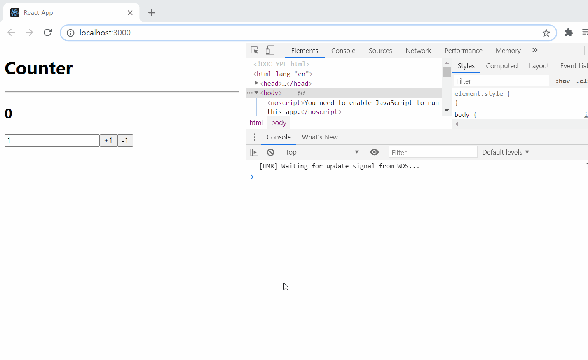
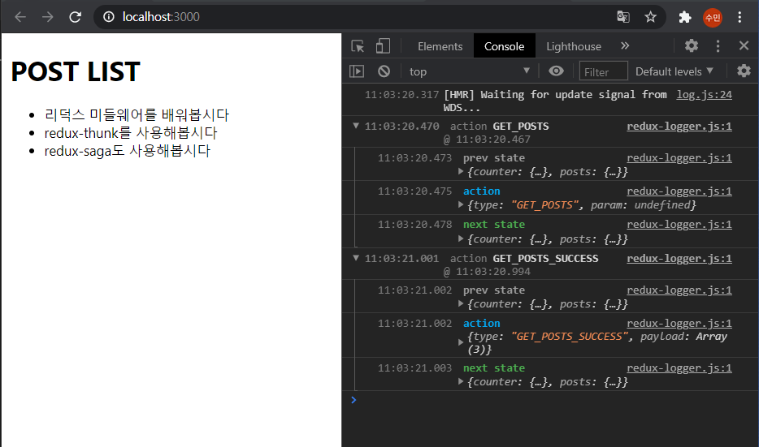
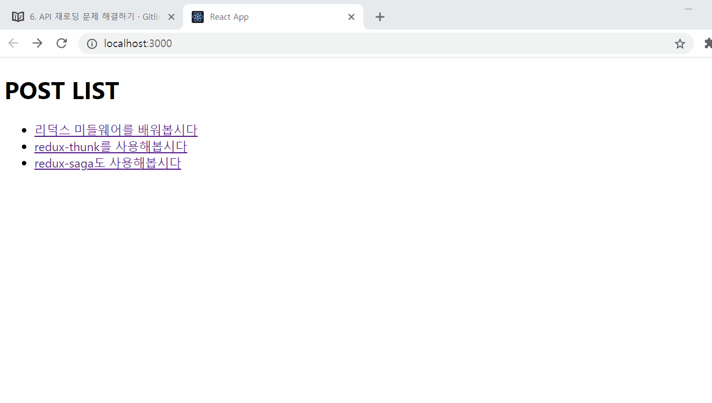

# 7장. 리덕스 미들웨어
리덕스 미들웨어는 리덕스가 지니고 있는 핵심 기능이다. Context API 또는 MobX를 사용하는 것과 차별화 되는 부분다.


리덕스 미들웨어를 사용하면 액션이 dispatch된 다음, 리듀서에서 해당 action을 받아와서 새로운 state를 반환하기 전에 추가적인 작업을 할 수 있따.

- 특정 조건에 따라 액션이 무시되게 만들 수 있다
- 액션을 콘솔에 출력하거나, 서버쪽에 로깅을 할 수 있다.
- 액션이 디스패치 됐을 때 이를 수정해서 리듀서에게 전달되도록 할 수 있다.
- 특정 액션이 발생했을 때 이에 기반하여 다른 액션이 발생되도록 할 수 있다.
- 특정 액션이 발생했을 때 특정 자바스크립트 함수를 실행시킬 수 있다.


보통 리덕스 미들웨어를 사용하는 주된 용도는 비동기 작업을 처리하기 위해서다.

리덕스 미들웨어는 커스텀하여 사용할 수 있지만, 일반적으로는 리덕스 미들웨어 라이브러리를 설치하여 사용한다. 비동기 작업에 관련된 미들웨어 라이브러리는 
- [redux-thunk](https://github.com/reduxjs/redux-thunk)
- [redux-saga](https://github.com/redux-saga/redux-saga)
- [redux-observable](https://redux-observable.js.org/)
- [redux-promise-middleware](https://www.npmjs.com/package/redux-promise-middleware)

등이 있다.

redux-saga와 redux-observable은 특정 action을 모니터링 할 수 있어, 특정 액션이 dispatch됐을 때, 원하는 함수를 호출하거나, router를 통해 다른 주소로 이동하는 것이 가능하다.

이 강의에서는 가장 많이 사용되는 redux-thunk와 redux-saga를 다룬다.

먼저 간단한 미들웨어를 직접 만들어보면서 미들웨어가 어떻게 작동하는지 알아본다. 그 다음 [redux-logger](https://www.npmjs.com/package/redux-logger)라이브러리를 사용하여 미들웨어를 적용하는 방법을 알아보고, redux-thunk와 redux-saga를 사용하여 비동기 작업을 효율적으로 처리하는 방법을 배워본다.


## 7-1. 리덕스 프로젝트 준비하기

- CRA로 새로운 프로젝트 준비 (생략)
- redux와 react-redux 라이브러리 설치

연습 프로젝트로 Counter App을 만들어본다.

### 리덕스 모듈 준비
Ducks 패턴으로 리덕스 모듈을 작성한다.
- modules 디렉토리 생성
- action 객체, action creator, initialStae, reducer 정의
- rootReducer 생성

> 기존 counter.js module 재사용

### react App에 리덕스 적용
- index.js에 Provider로 App 감싸기

### 프리젠테이셔널 컴포넌트 준비
- /src/components/Counter.js
- {number, onIncrease, onDecrease}를 props롤 받는다.

### 컨테이너 컴포넌트 준비
- /src/todoContainer/CounterContainerWithMiddleware.js
- App.js에 랜더링 하기


## 7-2. 미들웨어 만들어보고 이해하기
미들웨어를 직접 만들어보자.

### 리덕스 미들웨어의 템플릿
리덕스 미들웨어를 만들 땐 다음 템플릿을 사용한다.
```js
const middleware = store => next => action => {
    // something..
}
```

미들웨어는 결국 하나의 함수이다. 함수를 연달아 두번 리턴하는 함수이다.
화살표 함수대신 function 키워드로 생성하면 다음과 같다.
```js
function middleware(store){
    return function (next){
        return function (action) {
            // something
        }
    }
}
```

미들웨어 함수 내부의 각 파라미터들이 어떤 의미인지 알아본다.

첫번째 store는 redux store의 인스턴스 이다. dispatch, getState, subscribe 등의 내장 함수들을 갖고 있다.

두번째 next는 action을 다음 미들웨어에게 전달하는 함수이다. next(action) 형태로 사용하게 된다. **만약 다음 미들웨어가 없다면 reducer에게 action을 전달해준다.**

세번째 action은 현재 처리하고 있는 액션 객체이다.


미들웨어는 위와 같은 구조로 동작한다.

리덕스 스토어를 생성할 때 여러개의 미들웨어를 등록할 수 있다. 새로운 액션이 dispatch되면 가장 먼저 등록한 미들웨어가 호출된다. 첫번째 미들웨어에서 next(action)을 호출하면 다음 미들웨어로 action이 넘어간다. 미들웨어에서 store.dispatch()로 다른 action을 추가적으로 발생시킬 수 도 있다.

### 미들웨어 직접 작성해보기
/src/middlewares 라는 디렉토리를 만들고 myLogger.js라는 파일을 작성한다.

```js
// /src/middlewars/myLogger.js

const myLogger = store => next => action => {
    console.log(action);
    const result = next(action);
    return result
}

export default myLogger
```

### redux에 미들웨어 적용하기
redux에 미들웨어를 적용하기 위해서는 redux store를 생성하는 index.js 파일에 ```applyMiddleware```라는 함수를 사용하여 미들웨어를 적용한다.

```js
import {createStore, applyMiddleware} from 'redux'

const store = createStore(rootReducer, applyMiddleware(myLogger))
```


### 미들웨어 수정하기
action이 리듀서까지 전달되고 나서 새로운 state가 반환된 결과를 확인하고 싶은경우 다음과 같이 수정하면 된다.

```js
const myLogger = store => next => action => {
    console.log(action);
    const result = next(action);
    console.log('\t', store.getState())
    return result
```

이렇듯 미들웨어 안에서는 어떤 작업이라도 할 수 있다. 예를 들어 액션 객체를 객체가 아닌 함수로 받아오게 만들어서 ```typeof action === 'function'``` 인경우 해당 액션 함수를 실행하도록 할 수 있다 
> 이게 우리가 배울 redux-thunk 이다.

```js
const thunk = store => next => action => (
    typeof action === 'function'
        ? action(store.dispatch, store.getState())
        : next(action)
)
```

thunk 미들웨어는 다음과 같이 사용할 수 있다.

```js
const myThunk = () => (dispatch, getState) => {
    dispatch({type: 'HELLO'})
    dispatch({type: 'BYE'})
}

dispatch(myThunk())
```


## 7-3. redux-logger 사용 및 미들웨어와 DevTools 함께 사용하기

### redux-logger 사용하기
```bash
npm install redux-logger
```

index.js에서 redux-logger를 불러와 적용해본다.

```js
import logger from 'redux-logger'

const store = createStore(rootReducer, applyMiddleware(logger))
```


### Redux DevTools 사용하기
[메뉴얼 문서](https://www.npmjs.com/package/redux-devtools-extension#usage)에서 다음과 같이 안내하고 있다.
```js
import { createStore, applyMiddleware } from 'redux';
import { composeWithDevTools } from 'redux-devtools-extension';

const store = createStore(reducer, composeWithDevTools(
  applyMiddleware(...middleware),
  // other store enhancers if any
));
```


## 7-4. redux-thunk
redux-thunk는 리덕스에서 비동기 작업을 처리 할 때 가장 많이 사용하는 미들웨어이다. redux-thunk를 사용하면 **액션객체가 아닌 액션함수를 디스패치 할 수 있다.** redux-thunk는 redux 창시자인 DanAbramov가 만들었으며, 리덕스 공식 매뉴얼에서도 비동기 작업을 처리하기 위한 예시로 redux-thunk를 보여준다.

7-2.장에서 직접 미들웨어를 만들어보면서 다음과 같은 예시 코드를 만들었다.
```js
const thunk => store => next => action => 
    typeof action === 'function'
        ? action(store.dispatch, store.getState())
        : next(action)
```
실제로 redux-thunk 라이브러리의 [코드](https://github.com/reduxjs/redux-thunk/blob/master/src/index.js)는 위와 유사하다. 코드는 겨우 14줄에 불과하다. 이 라이브러리의 다운로드수는 140만대 이다.

이 미들웨어를 사용하면 함수를 dispatch할 수 있다고 했는데, 함수를 디스패치할 때는, 해당 함수에서 dispatch와 getState()를 파라미터로 받아줘야한다. dispatch와 getState()를 파라미터로 받는 함수를 만들어주는 함수를 thunk라고 부른다.

thunk의 예시는 다음과 같다.

```js
const getCommnets = () => {
    return (dispatch, getstate) => {
        const id = getstate().post.activeId

        dispatch({type: 'GET_COMMENTS'})

        api
            .getComments(id)
            .then(commnets => dispatch({type: 'GET_COMMENTS_SUCCESS', id, comments}))
            .catch(e => dispatch(type: 'GET_COMMENTS_ERROR', error: e}))
    }
}
```

thunk 함수에서 synce/await를 사용할 수도 있다.

```js
const getComments = () => async (dispatch, getState) => {
    const id = getState.post.activeId
    dispatch({type: 'GET_COMMENTS'})
    try{
        const commnets = await api.getComments(id)
        dispatch({type: 'GET_COMMENTS_SUCCESS', id, comments});
    } catch (e) {
        dispatch({type: 'GET_COMMENTS_ERROR', error: e})
    }
}
```

### redux-thunk 설치 및 적용하기

redux-thunk를 설치하고 index.js에 적용한다.

```js
import logger from 'redux-logger'
import ReduxThunk from 'redux-thunk'

const store = createStore(
  rootReducer, 
  composeWithDevTools(applyMiddleware(ReduxThunk, logger)) //logger는 가장 마지막에 와야한다.
);
```

### 카운터 딜레이 시키기
아주 기본적인 비동기 작업부터 해보자. thunk함수를 만들고 setTimeout을 사용하여 action이 dispatch되는 것을 1초씩 딜레시켜본다.

- /src/modules/counter.js 
    - counter 모듈에서 1초 딜레이되는 thunk 함수를 정의
- /src/todoContainers/CounterContainerWithMiddleware.js
    - action 객체를 dispatch하는 소스를 thunk 함수를 dispatch 하는 것으로 변경





## 7-5. redux-thunk로 프로미스 다루기

프로미스에 대하여 잘 알고있다는 전제하에 진행됩니다. 혹시나 잘 모르신다면 다음 링크들을 참조하세요.

- https://learnjs.vlpt.us/async/
- https://developer.mozilla.org/ko/docs/Web/JavaScript/Reference/Global_Objects/Promise

### Promise 정리
> 출처 : https://joshua1988.github.io/web-development/javascript/promise-for-beginners/
제이쿼리를 이용한 데이터를 가져오는 기본Promise 형태
```js
function getDataPromise() {
    return new Promise( (resolve, reject) => {
        $.get('url', (res) => {
            resolve(res)
        })
    })
}

getDataPromise().then( (data) => {
    console.log(data)
})
```

- Promise의 3가지 상태
    1. pending : new Promise() Promise 객체를 생성하면 pending 상태이다. 파라미터로 콜백함수를 선언할 수 있다. 콜백함수의 파라미터는 resolve와 reject이다.

    2. fulfilled : 파라미터로 받은 콜백함수의 resolve를 실행하면 fullfilled 상태가 된다. resolve가 실행되어 fulfilled 상태가 되면 .then()으로 결과 값을 받을 수 있다. .then() 메소드를 호출하면 새로운 Promise객체가 반환되기 때문에 Promise Chaining이 가능하다.

    3. reject : resolve대신 reject를 실행하면 reject 상태가 된다. 실패 이유는 .catch()로 받을 수 있다.


### 가짜 API 함수 만들기
먼저, Promise를 사용하여 데이터를 반환하는 가짜 API 함수를 만들어본다. /src/api/posts.js 라는 파일을 생성하여 다음 코드를 작성한다.

```js
// /src/api/posts.js

const sleep = n => new Promise( resolve => setTimeout(resolve, n));

// 가짜 포스트 목록 데이터
const posts = [
  {
    id: 1,
    title: '리덕스 미들웨어를 배워봅시다',
    body: '리덕스 미들웨어를 직접 만들어보면 이해하기 쉽죠.'
  },
  {
    id: 2,
    title: 'redux-thunk를 사용해봅시다',
    body: 'redux-thunk를 사용해서 비동기 작업을 처리해봅시다!'
  },
  {
    id: 3,
    title: 'redux-saga도 사용해봅시다',
    body:
      '나중엔 redux-saga를 사용해서 비동기 작업을 처리하는 방법도 배워볼 거예요.'
  }
];

export const getPosts = async () => {
    await sleep(500);
    return posts;
}

// ID로 포스트를 조회하는 비동기 함수
export const getPostById = async id => {
  await sleep(500); // 0.5초 쉬고
  return posts.find(post => post.id === id); // id 로 찾아서 반환
};
```


### posts 리덕스 모듈 준비하기
이제, posts라는 리덕스 모듈을 준비한다.

Promise객체를 다루는 리덕스 모듈을 만들때는 다음 사항을 고려해야한다.
- Promise가 시작, 성공, 실패 (pending, fulfilled, reject) 했을 때 각각에 맞는 action을 dispatch해야한다.
- 각 Promise 마다 thunk 함수를 만들어줘야 한다.  (thunk함수란, dispatch와 getState를 인자로 갖는 함수를 리턴하는 함수)
- reducer에서 action에 따라 로딩중, 성공, 에러 상태를 변경해주어야 한다.

#### /src/modules/posts.js
1. action type 정의
2. action creator 함수 정의, redux-thunk를 사용할 때는 thunk함수를 반환하는 action creator를 정의하면 된다.
3. initialState
4. reducer 함수 정의


#### 리덕스 모듈 리팩토링 하기
위에서 작성한 posts 리덕스 모듈을 반복되는 코드들이 상당히 많다. 이런 반복되는 코드는 따로 함수화 하여 리팩토링을 하는 습관을 들이자.

반복되는 코드는 다음과 같다.
- thunk 함수를 만들어주는 action creator
- reducer에서 loading, success, error 상태를 정의하는 코드

/src/lib 디렉토리를 만들고, asyncUtils.js 파일을 만든다.

#### /src/lib/asyncUtils.js
```js

// 내부에 Promise 객체(API 통신)를 사용하는 Thunk 함수를 생성해주는 함수정의
export const createPromiseThunk = (type, promiseCreator) => {
    const [SUCCESS, ERROR] = [`$(type)_SUCCESS`, `$(type)_ERROR`]

    return param => async (dispatch, getState) => {
        dispatch({type, param});
        try {
            // 결과물은 payload 라는 이름으로 통일한다.
            const payload = await promiseCreator(param)
            dispatch({type: SUCCESS, payload})
        } catch (e) {
            dispatch({type: ERROR, payload: e, error: true})
        }
    }
}

// 리듀서 반복되는 코드를 리팩토링 하기위한 코드
export const reducerUtils = {
    initial: (initialData = null) => ({
        loading: false,
        data: initialData,
        error: null
    }),
    loading: (prevState=null) => ({
        loading: true,
        data: prevState,
        error: null
    }),
    success: payload => ({
        loading: false,
        data: payload,
        error: null
    }),
    error: error =>({
        loading: false,
        data: null,
        error: error
    })
}

```

그리고 /src/modules/posts.js 에서 asyncUtitls 함수들을 사용하여 반복되는 코드를 리팩토링한다.

action creator와 reducer 함수의 반복되는 코드를 리팩토링했지만, 아직도 리듀서 쪽에는 반복되는 코드가 많이 있다. 그것은 바로 비동기 관련 action을 처리하기 위해 작성하는 TYPE, TYPE_SUCCESS, TYPE_ERROR 코드 묶음이다.

#### /src/lib/asyncUtils.js
```js
...
export const handleAsyncActions = (type, key) => {
    const [SUCCESS, ERROR] = [`$(type)_SUCCESS`, `$(type)_ERROR`];
    return (state, action) => {
        switch (action.type) {
            case type:
                return {
                    ...state,
                    [key]: reducerUtils.loading()
                }
            case SUCCESS:
                return {
                    ...state,
                    [key]: reducerUtils.success(action.payload)
                }
            case ERROR:
                return {
                    ...state,
                    [key]: reducerUtils.error(action.error)
                }
            default:
                return state;
            }
    }
}
```

### post 컴포넌트 구현하기
posts 리덕스 모듈 구현이 끝났다. 이제 컴포넌트를 구현해보자.

- /src/components/PostList.js 프리젠테이셔널 컴포넌트 구현
- /src/container/PostListContainer.js 컨테이너 컴포넌트 구현
- /src/AppPost.js 에 랜더링하기



### 리액트 라우터 적용하기
지금까지 react App에 redux 모듈을 정의하고 redux로 상태관리를 하도록 구현하였다. 또한, API 호출을 통해 비동기로 데이터를 받아오며, 비동기 상태 관리를 위해 redux-thunk 미들웨어를 적용하였다.

이제 react-router를 적용해서 posts 리스트 중 특정 post를 클릭했을 때 post.body를 보여주는 기능을 구현해본다.

- index.js 에 &lt;BrowserRouter&gt;로 App컴포넌트 감싸기
- Post.js 프리젠테이셔널 컴포넌트 구현
- PostContainer.js 컨테이너 컴포넌트 구현
- route 설정하기
    - pages 디렉터리를 생성
    - PostListPage.js 작성
    - PostPage.js 작성
    - AppPost.js에서 Route 컴포넌트를 설정
    - PostList 컴포넌트에 Link 컴포넌트 설정

특정 PostList를 선택했을 때 해당 Post 내용이 잘 출력되는지 확인해보자.



동작은 잘 하지만, 현재 두가지 문제점이 있다.
1. 특정 포스트를 열고 뒤로가기를 했을 때, 포스트 목록을 다시 불러오면서 '로딩중'이 나타난다.
2. 특정 포스트를 열고 뒤로가기 한 다음, 다른 포스트를 열면 이전에 열었던 포스트 내용이 잠깐 보여진다.

다음 색션에서 두가지 문제점을 해결해본다.

## 7-6. API 재로딩 문제 해결하기

### PostList 재로딩 문제 해결하기
PostList 재로딩 문제 해결방안은 두가지가 있다.
1. 데이터가 존재하는 경우 API 요청을 하지 않는 방법
2. API 요청을 하는데, 로딩중 메시지를 띄우지 않는 방법 : 이 방법은 사용자 입장에서는 재로딩이 되지 않는 것처럼 보이면서도 뒤로가기 했을 때 최신 데이터로 갱신할 수 있다.


### 1. 데이터가 존재하는 경우 API요청을 하지 않는 방법
```js
// /src/containers/PostListContainer.js

useEffect(() => {
    if (data) return;
    dispatch(getPosts());
  }, [data, dispatch]);

```

### 2. API 요청을 하지만 '로딩중' 문구를 띄우지 않기
- /src/lib/asyncUtils.js　- handleAsyncAction 함수 : 리듀서 로직을 리턴해주는 handelAsyncAction 함수에 keepData 파라미터를 추가한다. keepData 파라미터가 true이면 로딩할 때에도 데이터를 유지하도록 reducer 함수 로직을 수정한다.
```js
export const handleAsyncActions = (type, key, keepData = false) => {
    const [SUCCESS, ERROR] = [`${type}_SUCCESS`, `${type}_ERROR`];
    return (state, action) => {
        switch(action.type) {
            case type:
                return {
                    ...state,
                    [key]: reducerUtils.loading(keepDate ? state[key].data : null)
                };
            ...
        }
    }
}
```
- /src/modules/posts.js - posts 리듀서 함수 : keepData 파라미터를 true로 넘겨 데이터를 유지하도록 설정한다.
```js
export default function posts(state = initialState, action) {
  switch (action.type) {
    case GET_POSTS:
    case GET_POSTS_SUCCESS:
    case GET_POSTS_ERROR:
      return handleAsyncActions(GET_POSTS, 'posts', true)(state, action);
    ...
```
- /src/container/PostListContainer.js
```js

useEffect(() => {
    // if (data) return;
    dispatch(getPosts());
  }, [data, dispatch]);
```


### 포스트 조회 시 문제 해결하기
특정 post id를 조회할 때 발생하는 이전 포스트 내용이 잠깐 보이는 문제는 postList 재로딩 문제와 같은 방식으로는 처리할 수 없다. 주어진 post id에 따라 다른 결과물을 보여줘야하기 때문이다.

1. 컴포넌트가 언마운트 될 때 포스트 내용을 비우도록 하는 것
2. 이미 불러온 POST 내용을 다시 불러오는 문제


#### 1. 컴포넌트가 언마운트 될 때 포스트 내용을 비우는 처리
- posts redux 모듈에 CLEAR_POST라는 액션을 정의하고 해당 action이 dispatch되었을 때, status.post의 내용을 비워준다.
- Post 컨테이너 컴포넌트의 useEffect의 return 함수 부분(언마운트 될때 실행되는 함수)에 CLEAR_POST action을 dispatch시켜준다.

```js
useEffect(() => {
    dispatch(getPost(postId));
    return () => {
      dispatch(clearPost()); // 컴포넌트 언마운트 시점에 실행
    };
  }, [postId, dispatch]);
```

이렇게 하면 이전 포스트 내용이 잠깐 보이는 이슈가 해결 된다.

다만, 이미 읽었던 포스트를 불러오는 경우에도 새로 API요청을 하는 이슈가 아직 남아 있다. 이 문제를 개선하려면 posts redux 모듈에서 관리하는 state의 구조를 변경해야한다.

#### 2. 이미 불러온POST 내용을 다시 불러오는 문제

현재 redux state는 다음과 같다.
```js
{
  posts: {
    data,
    loading,
    error
  },
  post: {
    data,
    loading,
    error,
  }
}
```

변경할 구조는 다음과 같다.
```js
{
  posts: {
    data,
    loading,
    error
  },
  post: {
    '1': {
      data,
      loading,
      error
    },
    '2': {
      data,
      loading,
      error
    },
    [id]: {
      data,
      loading,
      error
    }
  }
}
```

state를 변경하려면 기존에 생성했던 asyncUtils에 만든 여러 함수를 수정해줘야한다. 기존 함수를 수정하는 대신, 새로운 이름으로 새 함수를 작성해본다.

- createPromiseThunkById : action creator 함수 생성시 thunk 함수를 만들어주는 함수
- handleAsyncActionsById : reducer에서 action에 따른 처리를 담당하는 함수

이제부터 비동기 작업과 관련된 action이 어떤 postId를 가르키는지 앟아야 한다. 그렇게 하기 위해서는 앞으로 action.meta 값에 id를 넣어주도록 한다.

#### /src/lib/asyncUtils.js
...


기존의 CLEAR_POST 액션은 더이상 필요하지 않다.

이제 state를 변경이 완료되었다. post 재로딩 방지를 위한 방법으로는, postList 재로딩 방지를 위한 방법과 동일하게 두가지 방식이 있다.

모두 구현 해보자.

- 해당 ID의 post 데이터가 state에 있으면 API 요청 방지