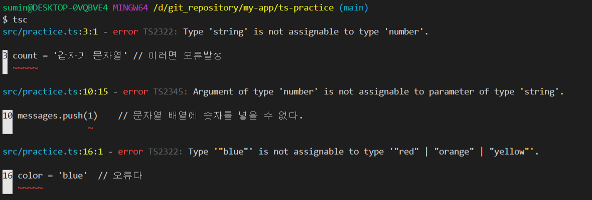

## 8장. 리액트 프로젝트에서 타입스크립트 사용하기

JavaScript는 weakly typed 언어이다.

```js
let value = 1;
value = 'hi';
value = [1,2,3,4]
value = null
```

IDE를 이용할 때 자동완성 기능이 Java / Python 등의 언어처럼 제대로 동작하지 않는다. TypeScript를 이용하면 이러한 개발의 불편함을 줄여준다.

TypeScript를 이용하는 이유는 다음 두가지 이다.
1. IDE를 적극 활용 가능 (자동완성, 타입확인)
2. 실수방지

TypeScript의 중요한 것을 알아보고 리액트에서 사용하는 방법을 알아본다.
TypeScript에 대해서 제대로 알아보고 싶다면 다음[링크](https://typescript-kr.github.io/)를 참조한다.

## 8-1. 타입 스크립트 연습

새로운 타입스크립트 프로젝트를 생성해본다.

```js
// mkdir ts-practice
// cd ts-practice
// npm init -y
```

### 타입스크립트 설정파일 생성하기

타입스크립트 설정파일인 tsconfig.json을 프로젝트 디렉토리 안에 생성한다.

#### tsconfig.json
```js
{
  "compilerOptions": {
    "target": "es5",
    "module": "commonjs",
    "strict": true,
    "esModuleInterop": true
  }
}
```

보통 직접 tsconfig를 작성하지 않고 명령어로 생성한다.

먼저, typescript를 global로 설치한다.

```bash
$ npm install -g typescript
```
그리고 프로젝트 디렉토리안에서 tsc --init을 입력하면 tsconfig.json 파일이 자동생성된다.

tsconfig의 옵션들에 대해 알아본다.

- target : 컴파일된 코드가 어떤 환경에서 실행될 지 정의, 예를들어 arrow function을 사용하고 target을 es5를 설정하면 function 키워드 함수로 변환해준다. es6로 설정하면 arrow function을 그대로 유지한다.
- module : 컴파일된 코드가 어떤 모듈 시스템을 사용할지 정의한다. 'common'으로 하면 export default Sample을 했을 때 exports.default = Sample로 변환해주지만, es2015로 하면 export default Sample을 유지한다.
- strict : 모든 타입 체킹 옵션을 활성화한다는 것을 의미
- esModuleInterop : commonjs 모듈 형태로 이루어진 파일을 es2015 모듈 형태로 불러올 수 있게 해줍니다. [(참고)](https://stackoverflow.com/questions/56238356/understanding-esmoduleinterop-in-tsconfig-file)
- outDir : 컴파일된 파일 저장 경로


### 타입스크립트 파일 만들기
src 디렉토리를 만들고 practice.ts라는 파일을 생성해보자.

```ts
const message : string = 'hello world'
console.log(message)
```
':string' 코드는 message 상수가 문자열임을 명시해준다. 만약 message 상수에 정수를 할당하면 에디터상에서 오류를 표시해준다.

이제 프로젝트 루트에서 ```tsc``` 명령어를 입력해본다. 그러면 ./dist/practice.js 경로에 다음과 같은 파일이 생성된다.

```js
"use strict";
var message = 'hello world';
console.log(message);
```

### ts 기본 타입
```js
let count = 0;
count += 1;
count = '갑자기 문자열' // 이러면 오류발생

const message : string = '안녕 타입스크립트'
const done : boolean = true
const numbers : number[] = [1,2,3] // 숫자배열
const messages : string[] = ['안녕', '타입스크립트']

messages.push(1)    // 문자열 배열에 숫자를 넣을 수 없다.

let mightBeUndefined : string | undefined = undefined // string일 수도, undefined일 수도 있다.
let nullableNumber : number | null 

let color : 'red' | 'orange' | 'yellow' = 'red'
color = 'blue'  // 오류다
```
위 파일을 tsc로 컴파일하면 다음과 같은 에러 메시지가 출력된다.



### 함수에서 타입정의하기
```js
function sum(x:number, y: number): number {
    return x+y
}
sum(1, 22)
```
파라미터로 어떤 타입을 넣어야하는지 바로 알 수 있다. 또한 리턴값의 타입도 알 수 있다.

참고로 함수에서 아무것도 반환하지 않는다면 반환 타입은 void이다.

```js
function returnNothing(): void {
  console.log('I am just saying hello world');
}
```

### interface 사용하기
interface는 클래스 또는 객체를 위한 타입을 지정 할 때 사용되는 문법이다.

```js
interface Shape {
    getArea(): number; // Shape interface에는 getArea()라는 함수가 반드시 있어야하며, 반환값은 number dlek.
}

class Circle implements Shape {
    radius: number;

    constructor(radius: number) {
        this.radius = radius
    }

    getArea() {
        return this.radius * this.radius * Math.PI;
    }
}

class Rectangle implements Shape {
    width: number;
    height: number;
    constructor(width: number, height: number) {
      this.width = width;
      this.height = height;
    }
    getArea() {
      return this.width * this.height;
    }
  }
  
  const shapes: Shape[] = [new Circle(5), new Rectangle(10, 5)];
  
  shapes.forEach(shape => {
    console.log(shape.getArea());
  });
```


### 일반 객체를 interface로 타입 설정하기
클래스가 아닌 일반 객체를 interface를 사용하여 타입지정 할 수 있다.

```js
interface Person {
    name: string;
    age?: number; // ?는 설정할 수도 있고 안할 수도 있다는 의미
}

interface Developer extends Person {
    skills: string[];
}

const person: Person = {
    name: '김수민',
    age: 30
}

const expert: Developer = {
    name: '김개발',
    age: 31,
    skills: ['javascript', 'react']
}

const people: Person[] = [person, expert]
```

### Type Alias 사용하기
```js
type Person = {
    name: string,
    age?: number
}

type Developer = Person & { // &는 타입을 합칠때 사용
    skills: string[]
}

type People: Person[];
type Color: 'red' | 'green' | 'blue';
```


### Generics
제너릭(Generics)은 타입스크립트에서 함수, 클래스, interface, type alias 를 사용하게 될 때 여러 종류의 타입에 대하여 호환을 맞춰야 하는 상황에서 사용하는 문법
```js
function merge(a: any, b: any): any {
  return {
    ...a,
    ...b
  };
}

const merged = merge({ foo: 1 }, { bar: 1 });
```
any를 쓰면 타입 유추를 할 수 없다. 이런상황에서 generics를 사용한다.

```js
function wrap<T> (a: T) {
    return {a}
}
```

### interface에서 Generics 사용
```js
interface Items<T> {
  list: T[];
}

const items: Items<string> = {
  list: ['a', 'b', 'c']
};
```

### type에서 Generics 사용
```js
type Items<T> = {
  list: T[];
};

const items: Items<string> = {
  list: ['a', 'b', 'c']
};
```

### 클래스에서 Generics 사용
```js
class Queue<T> {
  list: T[] = [];
  get length() {
    return this.list.length;
  }
  enqueue(item: T) {
    this.list.push(item);
  }
  dequeue() {
    return this.list.shift();
  }
}

const queue = new Queue<number>();
queue.enqueue(0);
```

## 8-2. 리액트 컴포넌트 타입스크립트로 작성하기

### 프로젝트 생성
우선, 타입스크립트를 사용하는 리액트 프로젝트를 만들어보자.
```bash
$ npx create-react-app ts-react-tutorial --typescript
```

ts-react-tutorial 프로젝트의 src 디렉토리안에 App.tsx 파일이 있다. 타입스크립트를 사용하는 리액트 컴포넌트는 *.tsx 확장자를 사용한다.

#### App.tsx
```js
import React from 'react';
import logo from './logo.svg';
import './App.css';

const App: React.FC = () => {
  return (
    <div></div>
  )
}

export default App;
```
App컴포넌트는 React.FC 라는 것을 사용하여 컴포넌트의 type을 지정했다. 이렇게 타입을 지정하는 것이 좋을 수 도 있고 나쁠 수도 있다.

새로운 컴포넌트를 선언하면서 React.FC를 사용하는 것과 사용하지 않는 것이 어떤 차이가 있는지 알아보도록 한다.


### 새로운 컴포넌트 만들기
Greetings 라는 새로운 컴포넌트를 작성해보자.

#### src/Greetings.tsx
```js
import React from 'react';

type GreetingProps = {
  name: string
}

const Greetings: React.FC<GreetingsProps> = ({name}) => (
  <div> Hello, {name} </div>
)

export default Greetings;
```
React.FC를 사용할 때 props의 타입을 Generics로 넣어서 사용한다. 이렇게 React.FC를 사용해서 얻을 수 있는 이점을 두가지가 있다.

첫번째는, props에 기본적으로 children이 들어가 있다는 점이다.

> React.FC는 사용하지 않는게 좋은것 같다.

아무튼 리액트 컴포넌트의 props를 type으로 정의하면, 해당 컴포넌트를 사용할 때 필수로 전달해야하는 props 값, 함수들을 IDE 기능을 통해 확인하여 쉽게 개발할 수 있다.

## 8-3. 타입스크립트로 리액트 상태관리하기

타입스크립트를 사용하는 리액트 컴포넌트에서 useState와 useReducer를 사용하여 컴포넌트의 상태를 관맇나느 방법을 알아본다.

### 카운터 만들어보기
고로 useState를 사용 할 때 Generics 를 사용하지 않아도 알아서 타입을 유추하기 때문에 생략해도 상관없다.

하지만, state가 null일 수도 있을 경우에는 Generics를 사용하면 좋다.

```js
type Info = {
  name: string;
  description: string
}
const [info, setInfo] = useState<Info | null>(null)
```

### 인풋상태 관리하기
인풋은 이벤트를 다뤄야하기 때문에 type지정을 어떻게할지 헷갈릴수 있다.

```js
return (
        <form onSubmit={handleSubmit} >
            <input name="name" value={name} onChange={handleChange} />
            <input name="description" value={description} onChange={handleChange} />
            <button type="submit">등록</button>
        </form>
    )
```
input의 onSubmit과 onChange의 e객체의 타입이 무엇인지 알고싶다면, 해당 속성에 마우스를 올려본다. 그러면 어떤 타입을 지정해야하는지 알려준다.
```js
React.FormEvent<HTMLFormElement>
React.ChangeEvent<HTMLInputElement>
```
다음과 같이 MyFormProps type을 정의하고 App.tsx에서 자동완성을 활용하여 사용해보자.

```js
type MyFormProps = {
    onSubmit: (form: {name: string; description: string}) => void
}

function MyForm({onSubmit}: MyFormProps) {
    const [input, setInput] = useState({
        name: '',
        description: ''
    })
    const {name, description} = input

    const handleSubmit = (e: React.FormEvent<HTMLFormElement>) => {
        e.preventDefault();
        // console.log("submit : ", name, description)
        onSubmit(input)
        setInput({
            name: '',
            description: ''
        })
    }
    const handleChange = (e: React.ChangeEvent<HTMLInputElement>) => {
        const {name, value} = e.target
        // console.log(name, value)
        setInput({
            ...input,
            [name]: value
        })
    }

    return (
        <form onSubmit={handleSubmit} >
            <input name="name" value={name} onChange={handleChange} />
            <input name="description" value={description} onChange={handleChange} />
            <button type="submit">등록</button>
        </form>
    )
}

export default MyForm
```

```js
import React from 'react';
import Counter from './components/Counter'
import MyForm from './components/MyForm'

function App() {

  return (
    <div>
      <Counter />
      <MyForm onSubmit={(form: {
          name: string;
          description: string;
      }) => {
        console.log(form)
      }}/>
    </div>
  );
}

export default App;

```

### useReducer 사용하기
타입스크립트와 useReducer를 사용해보자.

```js
type Action = {type: 'INCREASE'} | {type: 'DECREASE'};

const reducer = (state: number, action: Action) => {
    switch(action.type) {
        case 'INCREASE':
            return state + 1
        case 'DECREASE':
            return state - 1
        default:
            return state
    }
}
...
```
타입스크립트로 Action type을 명시해주면 dispatch할 때 자동완성이 지원된다.


## 8-4. TypeScript와 ContextAPI 활용하기
state를 위한 context를 만들고 dispatch를 위한 context를 생성할 것이다.

#### src/components/SampleContext.tsx
```js
import React, {useReducer, useContext, createContext, Dispatch} from 'react'

type Color = 'red' | 'green' | 'blue';

type State = {
    count: number;
    text: string;
    color: Color;
    isGood: boolean
}

type Action = 
    | {type: 'SET_COUNT'; count:number}
    | {type: 'SET_TEXT'; text:string}
    | {type: 'SET_COLOR'; color:Color}
    | {type: 'TOGGLE_GOOD';}

type SampleDispatch = Dispatch<Action>;

const SampleStateContext = createContext<State|null>(null)
const SampleDispatchContext = createContext<SampleDispatch|null>(null)

const reducer = (state: State, action: Action) => {
    switch(action.type) {
        case 'SET_COUNT':
            return {
                ...state,
                count: action.count
            }
        case 'SET_COLOR':
            return {
                ...state,
                color: action.color
            }
        case 'SET_TEXT':
            return {
                ...state,
                text: action.text
            }
        case 'TOGGLE_GOOD':
            return {
                ...state,
                isGood: !state.isGood
            }
        default :
            return state
    }
}

export function SampleProvider({children}: {children: React.ReactNode}) {
    const [state, dispatch] = useReducer(reducer, {
        count: 0,
        text: 'Hello',
        color: 'red',
        isGood: true
    });

    return (
        <SampleStateContext.Provider value={state}>
            <SampleDispatchContext.Provider value={dispatch}>
                {children}
            </SampleDispatchContext.Provider>
        </SampleStateContext.Provider>
    )
}

export function useSampleState() {
    const state = useContext(SampleStateContext);
    if (!state) throw new Error('Cannot find SampleProvider'); // 유효하지 않을땐 에러를 발생
    return state;
  }
  
  export function useSampleDispatch() {
    const dispatch = useContext(SampleDispatchContext);
    if (!dispatch) throw new Error('Cannot find SampleProvider'); // 유효하지 않을땐 에러를 발생
    return dispatch;
  }
```

#### /src/components/ReducerSample.tsx
```js
import React from 'react'
import {useSampleDispatch, useSampleState} from './SampleContext'

function ReducerSample() {
    const state = useSampleState()
    const dispatch = useSampleDispatch()

    const setCount = () => dispatch({ type: 'SET_COUNT', count: 5 }); // count 를 넣지 않으면 에러발생
    const setText = () => dispatch({ type: 'SET_TEXT', text: 'bye' }); // text 를 넣지 않으면 에러 발생
    const setColor = () => dispatch({ type: 'SET_COLOR', color: 'green' }); // orange 를 넣지 않으면 에러 발생
    const toggleGood = () => dispatch({ type: 'TOGGLE_GOOD' });

    return (
        <div>
            <p>
                <code>count: </code> {state.count}
            </p>
            <p>
                <code>text: </code> {state.text}
            </p>
            <p>
                <code>color: </code> {state.color}
            </p>
            <p>
                <code>isGood: </code> {state.isGood ? 'true' : 'false'}
            </p>
            <div>
                <button onClick={setCount}>SET_COUNT</button>
                <button onClick={setText}>SET_TEXT</button>
                <button onClick={setColor}>SET_COLOR</button>
                <button onClick={toggleGood}>TOGGLE_GOOD</button>
            </div>
        </div>
    )
}

export default ReducerSample
```
